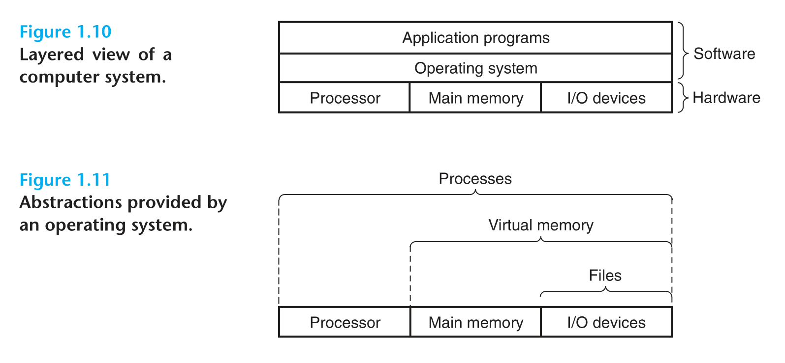

# Ch01—A Tour of Computer Systems

## Information: Bits + Context

- 1 `Byte` = 8 `bit`
- 只由
  `ASCII` 字符构成的文件称为 **文本文件（text files）** ，所有其他文件都称为 **二进制文件（binary files）**
- 系统中所有的信息都是由一串比特表示的。区分不同数据对象的唯一方法是我们读到这些数据对象时的 **上下文（context）**

## Compilation

## Programs Are Translated by Other Programs into Different Forms

`shell` 是一个 **命令行解释器** ，它输出一个提示符，等待输入一个命令行，然后执行这个命令。如果该命令行的第一个单词不是一个内置的 `shell` 命令，那么
`shell` 就会假设这是一个可执行文件的名字，它将加载并运行这个文件。

## Hardware Organization of a System

- **总线** ：传送定长的字节块，也就是 **字** （ `word` ），字长为 4（或 8） `Byte`

- **I / O 设备** ：通过一个 **控制器** （controller，在 I / O 设备本身）或 **适配器** （adapter，在主板上）与
  I / 0 总线相连

- **主存** ：物理上，由一组 **DRAM** 芯片组成；逻辑上，一个线性的 **字节数组**

- **处理器（CPU）** ：
  1. 解释（或执行）存储在主存中指令的引擎。核心是一个大小为一个字的存储设备（或寄存器），称为 **程序计数器（PC）** 。在任何时刻，PC 都指向主存中的某条机器语言指令（即含有该条指令的地址）
  2. **指令集架构（instruction set architecture）** 描述的是每条机器代码指令的效果； **微体系结构（microarchitecture）** 描述的是处理器实际上是如何实现的

## Memory Hierarchy

## Operating System

### Virtual Memory

## Amdahl’s Law

假设系统某部分所需执行时间与该时间的比例为 $\alpha$ , 而该部分性能提升比例为 $k$ ，则加速比为
$$
S = \frac{1}{(1 - \alpha) + \frac{\alpha}{k}}
$$

## Abstractions

