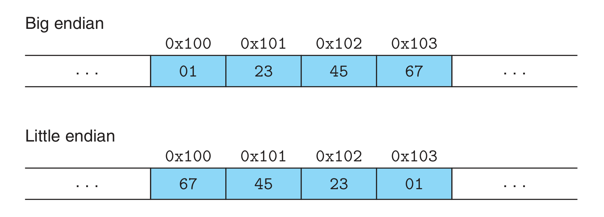
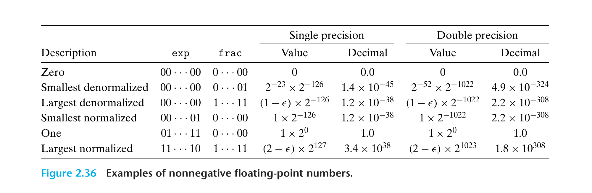
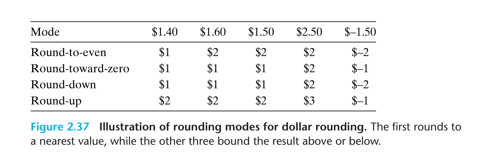

# Ch02—Representing and Manipulating Information

## Information Storage

### Data Sizes

1. 每台计算机有一个 **字长（word size）** ，决定了虚拟地址空间的最大值是多少

2. 通过修改编译选项，可以生成在不同机器上运行的程序

   ```bash
   # 可以在 32 位机器运行，也可以在 64 位机器运行（向后兼容）
   linux> gcc -m32 prog.c

   # 只能在 32 位机器运行
   linux> gcc -m64 prog.c
   ```

3. 基本数据类型大小

   

### Addressing and Byte Ordering

#### Endian



#### Byte Print Program

```c
#include <stdio.h>
typedef unsigned char *byte_pointer;

void show_bytes(byte_pointer start, size_t len) {
    int i;
    for (i = 0; i < len; i++)
        printf(" %.2x", start[i]);
    printf("\n");
}
void show_int(int x) {
    show_bytes((byte_pointer) &x, sizeof(int));
}
void show_float(float x) {
    show_bytes((byte_pointer) &x, sizeof(float));
}
void show_pointer(void *x) {
    show_bytes((byte_pointer) &x, sizeof(void *));
}
```

## Integer Arithmetic

- 补码最小值的相反数是他自身

### Dividing by Powers of 2

- 规则：向靠近 0 的方向舍入

#### 偏置（biasing）

- 对于负数运算，移位会导致结果向下舍入，因此需要在移位前加上偏置量：$bias = (1 << k) - 1$

- C 语言表示：

  ```c
  (x < 0 ? x + (1 << k) - 1 : x) >> k
  ```

- 举例（以 -12340 作为被除数）：


## Floating Point

### IEEE Floating-Point Representation

$$
V = (-1)^s \times M \times 2^E
$$

1. s(sign)： **符号** 。0 表示正数，1 表示负数
2. M(significand)： **尾数** 。一个二进制小数
3. E(exponent)： **阶码** 。对浮点数加权

#### Standard Floating-Point Formats


#### Floating-Point Type


##### Case 1: Normalized Values

用来表示大多数数值

**阶码：$E = e - bias$**

其中，$bias(float) = 2 ^ {8 - 1} - 1 = 127$ ， $bias(double) = 2 ^ {11 - 1} - 1 = 1023$

因此，可以得到阶码的范围：

|  Type  | bias | $e_{min}$ | $e_{max}$ | $E_{min}$ | $E_{max}$ |
| :----: | :--: | :-------: | :-------: | :-------: | :-------: |
| float  | 127  |     1     |    254    |   -126    |    127    |
| double | 1023 |     1     |   2046    |   -1022   |   1023    |

**尾数： $M = 1 + f$**

其中，对于 float 类型， $f = 0.f_{22}f_{21}\dots f_0$ （double 类型类似）

对于非零值，总能调整 $E$ 使得 $M$ 范围在 1 ~ 2 之间，所以首位的 1 不用显示表现出来

##### Case 2: Denormalized Values

用来表示 0 或者很小的数值，**表示 0 时有 +0 和 -0 之分**

**阶码：$E = 1 - bias$**

注意，这里是 $1 - bias$ 而不是 $-bias$

这样做可以实现最大非规格化数到最小规格化数的平滑转变

**尾数： $M = f$**

直接用尾数表示

##### Case 3: Special Values

阶码字段全为 1

1. $+\infty$ ：符号位为 0，小数字段全为 0
2. $-\infty$ ：符号位为 1，小数字段全为 0
3. NaN：小数字段不为 0

### Example Numbers

#### 8-bit floating-point


#### nonnegative floating-point



- $\epsilon $ 表示 $2^{-n}$

### Rounding

4 ways



### Floating-Point Operations

- 优点：满足单调性
- 缺点：不满足结合性和分配性
