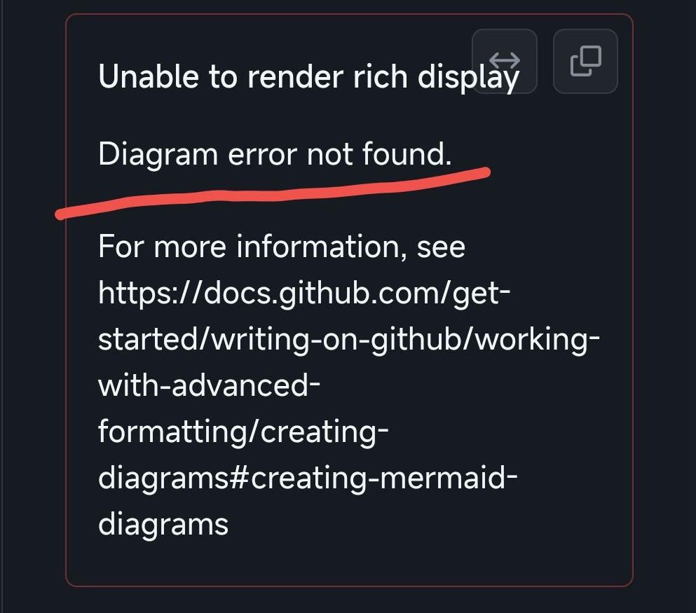

# Mermaid 踩坑日记

## 缘起

2023 年 12 月开始使用 Typora 写 `Markdown` 笔记，刚了解到部分 `Markdown` 编辑器支持一个叫做 `Mermaid` 的图表工具，能够绘制流程图、状态图等，十分方便。因为碰巧在写数电实验报告，想到可以用 `Mermaid` 画流程图，于是开始了尝试。

## 踩坑

发生了一件非常神奇的事情，我写的代码可以在 `Typora` ，`VS Code` 的 `Markdown` 插件，以及 `Mermaid` [官网](https://mermaid.js.org/) 的在线编辑器中成功渲染，唯独不能再 `Github` 上正常显示。最气人的是他不给出任何报错信息，害我捣鼓了半天：

## 真相

最终通过对 `Markdown` 文件中 `Mermaid` 块的内容一行一行排查，终于找到了原因。我们先查看下面代码：

在 `Github` 上，我发现代码不能正常显示，究其原因，**代码的文本里有 `Unicode` 符号**——中文逗号，为了解决这个问题，只需要**在文本前后添加英文双引号**即可：

现在就能正常显示了。

所以，还是养成用英文双引号括好文本的习惯叭。。。

## 附录

[Mermaid | Diagramming and charting tool](https://mermaid.js.org/)

[About Mermaid | Mermaid](https://mermaid.js.org/intro/)
