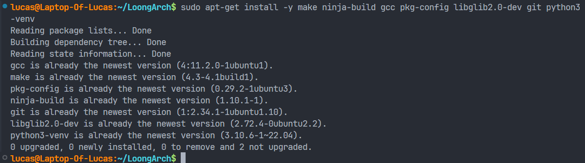
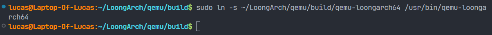
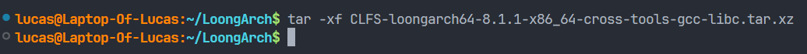

# 搭建 LoongArch 汇编实验环境 (Linux)

## 先前准备

***注意：任何用到 `sudo` 指令的地方会提示输入密码，输入你自己的密码即可***

1. 首先在主目录下创建一个 `LoongArch` 文件夹用来存放环境

    ```bash
    cd ~ && mkdir LoongArch
    ```

2. 然后进入 `LoongArch` 文件夹

    ```bash
    cd LoongArch
    ```

完成后如下图


## 编译安装 qemu-loongarch64

1. 下载[这里](https://download.qemu.org/qemu-8.2.2.tar.xz)QEMU源码

    ```bash
    git clone https://gitlab.com/qemu-project/qemu.git
    ```

    完成后如下图

    

2. 安装依赖

    安装前可以先更新一下软件包（非必须）

    ```bash
    sudo apt-get update && sudo apt-get upgrade
    ```

    这里会提示 `Do you want to continue?` ，输入 `Y` 即可

    

    然后安装依赖

    ```bash
    sudo apt-get install -y make ninja-build gcc pkg-config libglib2.0-dev git python3-venv
    ```

    安装好后如下图（这里已经安装好）

    

3. 编译 QEMU

    在 `LoongArch` 目录下输入以下命令，进入 `build` 子目录

    ```bash
    cd qemu && mkdir build && cd build
    ```

    

    然后依次输入以下两条命令进行编译

    ```bash
    ../configure --target-list=loongarch64-linux-user
    ```

    ```bash
    ninja
    ```

    完成后如下图（图太长了截不完）

    

    输入如下命令

    ```bash
    ./qemu-loongarch64 --version
    ```

    显示类似版本信息，则配置成功

    

4. 建立符号链接到 `usr/bin/` 目录下，方便以后使用

    ```bash
    sudo ln -s ~/LoongArch/qemu/build/qemu-loongarch64 /usr/bin/qemu-loongarch64
    ```

    

## 下载loongarch-gcc交叉工具链

1. 先回到 `LoongArch` 目录下

    ```bash
    cd ../..
    ```

    完成后如下图

    

2. 下载交叉工具的压缩包

    ```bash
    wget https://github.com/sunhaiyong1978/CLFS-for-LoongArch/releases/download/8.1/CLFS-loongarch64-8.1.1-x86_64-cross-tools-gcc-libc.tar.xz
    ```

    完成后如下图

    

3. 解压

    ```bash
    tar -xf CLFS-loongarch64-8.1.1-x86_64-cross-tools-gcc-libc.tar.xz
    ```

    如下图

    

    输入如下命令

    ```bash
    ./cross-tools/bin/loongarch64-unknown-linux-gnu-gcc --version
    ```

    显示类似版本信息，则配置成功

    

4. 建立符号链接到 `usr/bin/` 目录下，方便以后使用

    ```bash
    sudo ln -s ~/LoongArch/cross-tools/bin/loongarch64-unknown-linux-gnu-gcc /usr/bin/loongarch64-unknown-linux-gnu-gcc
    ```

    如下图

    

## 编写测试（用任何编辑器即可，可以创建在任意目录下）

编写 hello_loongarch.S

```asm
# LoongArch Assembler program to print "Hello World!"
# to stdout.
#
# a0-a2 - parameters to linux syscall services
# a7 - linux syscall number
#

.global _start      # Provide program starting address to linker

# Setup the parameters to print hello world
# and then call Linux to do it.

_start:

        li.d  $a0, 1          # 1 = StdOut
        la    $a1, helloworld # load address of helloworld
        li.d  $a2, 17         # length of our string
        li.d  $a7, 64         # linux write system call
        syscall 0             # Call linux to output the string

# Setup the parameters to exit the program
# and then call Linux to do it.

        li.d    $a0, 0       # Use 0 return code
        li.d    $a7, 93      # Service command code 93 terminates
        syscall 0            # Call linux to terminate the program

.data
helloworld:      .ascii "Hello LoongArch!\n"
```

## 编译测试

如果按照先前步骤在 `/usr/bin` 设置好符号链接，只需要输入

```bash
loongarch64-unknown-linux-gnu-gcc -nostdlib -static hello_loongarch.S -o hello_loongarch
```

## 运行测试

如果按照先前步骤在 `/usr/bin` 设置好符号链接，只需要输入

```bash
qemu-loongarch64 ./hello_loongarch
```

如图，成功打印输出，配置完成


## 参考资料

* LongArch指令集手册[https://github.com/loongson/LoongArch-Documentation/releases/latest/download/LoongArch-Vol1-v1.10-CN.pdf](https://github.com/loongson/LoongArch-Documentation/releases/latest/download/LoongArch-Vol1-v1.10-CN.pdf)
* LoongArch ABI[https://loongson.github.io/LoongArch-Documentation/LoongArch-ELF-ABI-CN.html](https://loongson.github.io/LoongArch-Documentation/LoongArch-ELF-ABI-CN.html)
* LoongArch 汇编参考[https://github.com/loongson/la-asm-manual/releases/download/draft/la-asm-manual.pdf](https://github.com/loongson/la-asm-manual/releases/download/draft/la-asm-manual.pdf)
* QEMU[https://www.qemu.org/](https://www.qemu.org/)
