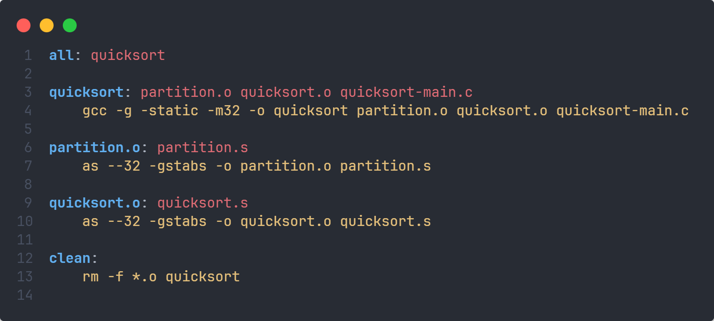
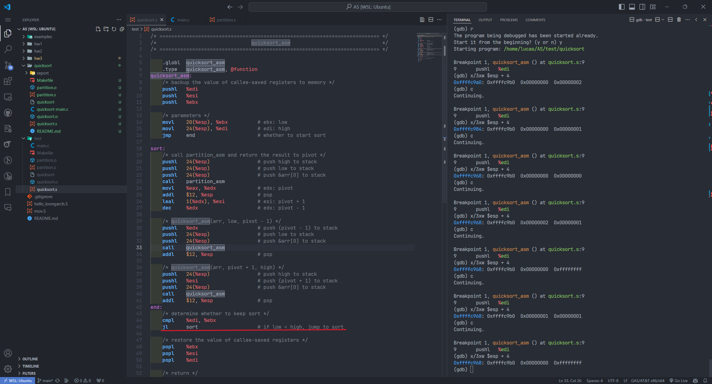

# 2024春汇编语言小组作业1——快速排序的汇编实现

## 实验环境

- 操作系统：`Ubuntu 22.04.4 LTS on Windows 10 x86_64`
- 汇编语言：`x86-32` 架构， `AT&T` 语法

## 实验准备

从 [quicksort](https://github.com/tyssjhx/quicksort) 克隆代码框架到本地，按照 `README.md` 文件说明，编写 `partition_asm` 和 `quicksort_asm` 函数，并利用脚本进行检测。

## 实验内容

### 测试脚本改写

因为编译过程会生成可执行文件和可重定向文件，为了方便管理，我们改写了 `quicksort.sh` 脚本。通过以下 `Makefile` 文件实现一键编译和清理功能：

### 编写 `partition_asm` 函数

`partition_asm` 函数接受三个参数：一个数组的指针和两个整数，分别表示数组的低索引和高索引。

在每个函数的开头，我们首先要对 `%edi` 、 `%esi` 和 `%ebx` 这三个寄存器进行压栈操作，因为这三个是被调用者保存寄存器。

然后，它从栈中获取参数，并将它们移动到寄存器中。 `%eax` 存储数组的地址， `%ebx` 存储低索引， `%ecx` 存储高索引。 `%edx` 存储基准值，即数组的低索引处的值。

接下来通过三个跳转类指令实现一个大循环套三个小循环， `cmp` 指令设置状态码，然后通过跳转类指令完成跳转，确定是否跳出循环。

具体步骤及含义详见下图代码和注释：

### 编写 `quicksort_asm` 函数

关于函数的传参以及被调用者寄存器的压栈操作见上一部分。

这里只有一个条件判断语句，所以我划分了两个标签 `sort` 和 `end` ，如果满足 `low < high` ，就执行 `sort` 中的内容。

快速排序涉及到三次函数调用，一次 `partition_asm` 和两次自身递归调用。因此在调用前需要手动压栈传递参数，并在调用结束时通过 `addl $12, %esp` 使栈指针回到正常位置（因为两个参数来自内存，一个参数来自被调用者保存寄存器，因此不需要 `pop` 来恢复数据）。

在计算 `pivot + 1` 和 `pivot - 1` 时，我们没有使用常见的 `add` 和 `sub` 指令，而是利用 `leal` （加载有效地址） 和 `dec` 指令，减少了计算所需要的步骤。

具体步骤及含义详见下图代码和注释：

### 调试中遇到的问题

在调试 `quicksort_asm` 函数过程中，出现了无限死循环的情况，起初以为是递归调用出现了问题，后来通过 `gdb` 打印内存地址，才发现 `quicksort_asm` 的返回地址并没有减少（如果递归调用不停止，按理说栈指针的值应该不断减少，因为栈向下增长）。

最终找到问题在 `jl` 上。因为 `sort` 部分执行完后没有返回，按顺序又进行了一次 `low < high` 的判断。相当于 `if` 语句变成了 `while` 语句，且条件始终为真或假。

### 最终结果

成功通过测试：

## 收获与反思

通过本次实验，我们也收获到了很多：

1. 对快速排序算法的原理和实现细节有了更深入的理解。

2. 让我们熟悉了 `x86-32` 汇编语言的语法和指令集。一方面对于数据传输指令、跳转指令等有了更深刻的认识，另一方面也加深了我们对计算机系统的认知。不仅巩固了我们对不同寄存器特定功能的理解，也让我们学会了如何利用栈在函数调用中传递参数，这与高级语言有很大的差别。与此同时，在不断的试错中，我们逐渐积累了将 C 语言代码转化为汇编代码的相关经验（尤其是条件、循环等语句的实现）。

3. 在代码的编写、汇编、链接和调试等过程中，我们也熟悉了新工具的使用方法。例如，用 `as --32` 和 `ld -m elf_i386` 编译出 32 位系统上的可执行文件。此外，我们还使用 `Makefile` 脚本工具便捷地实现多文件项目的管理。最后在调试过程中，我们也学会了 `gdb` 的新使用方法，比如用 `info registers` 查看寄存器的值，以及用 `x` 打印内存，受益匪浅。

4. 由于汇编代码可读性较差，因此我们也养成了多写注释的好习惯。
