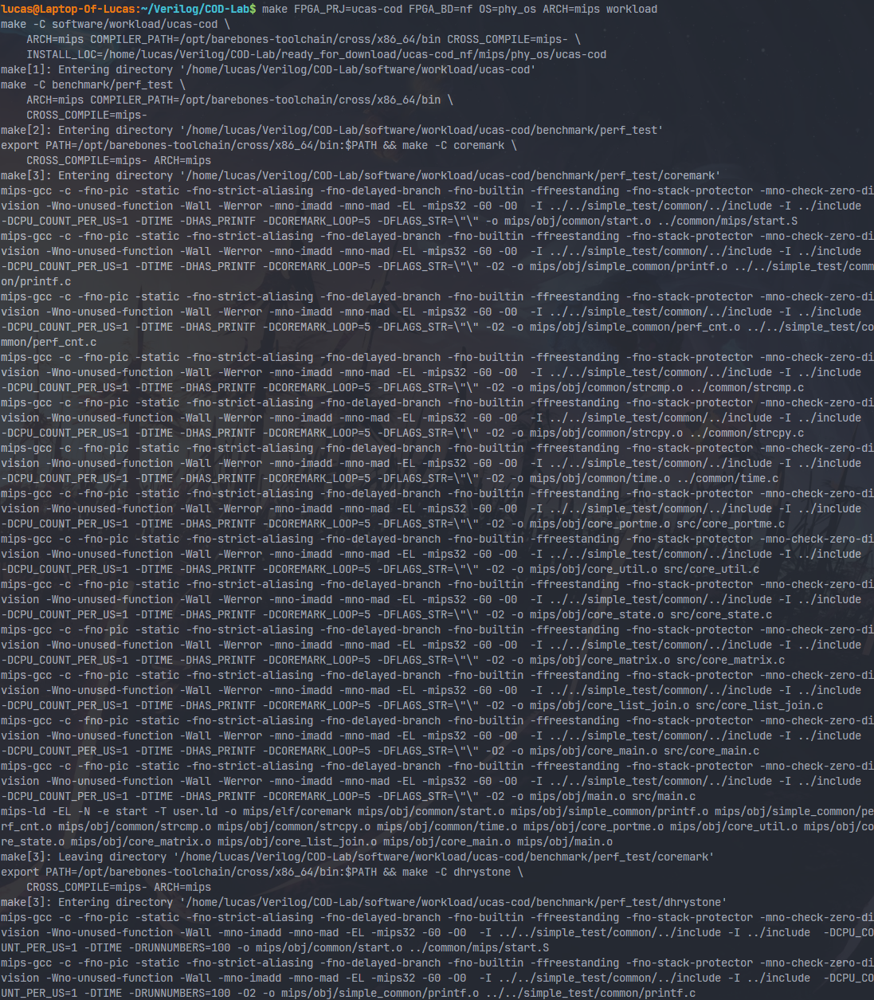
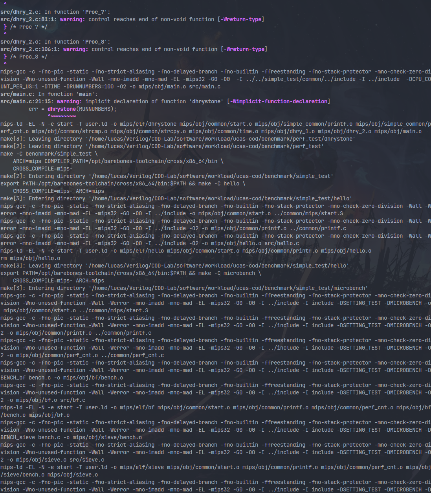

# cod-lab 本地仿真环境配置

经过亲身实践，本方法可以在 S-IDE 和 Ubuntu 22.04.4 LTS on Windows 10 x86_64 环境下成功进行软件编译和行为仿真。（其他 Linux 版本应该也可以......吧）

## verilator

在 [这里](https://github.com/verilator/verilator/releases/tag/v4.222) 下载 4.222 版本的 `verilator` 。


找一个目录（不要放到框架里，可以选择 `~` 主目录）本地解压即可，然后 `cd verilator-4.222`

依次执行以下命令

```bash
sudo apt-get install git help2man perl python3 make autoconf g++ flex bison ccache

sudo apt-get install libgoogle-perftools-dev numactl perl-doc


autoconf         # Create ./configure script
./configure      # Configure and create Makefile

# 下面这两步会很漫长，如果在 S-IDE 上编译可能会花个二三十分钟
# 如果 S-IDE 分配的内存太小，可能因为内存占用过大被操作系统杀死进程
# 我测试 S-IDE 的时候开了 16 G，也整了很久
make -j `nproc`  # Build Verilator itself (if error, try just 'make')
sudo make install
```

## mips-gcc

依次执行以下命令

```bash
cd && git clone https://github.com/rm-hull/barebones-toolchain.git
sudo ln -s ~/barebones-toolchain/cross/x86_64/bin/mips-gcc /usr/local/bin/mips-gcc
```

## 展示

以 `hello` 为例

### 软件部分






没错它就是这么长

### 硬件部分

!!! warning
    记得先把 `fpga/sim_out/custom_cpu` 和 `verilator_include` 删干净！！！


