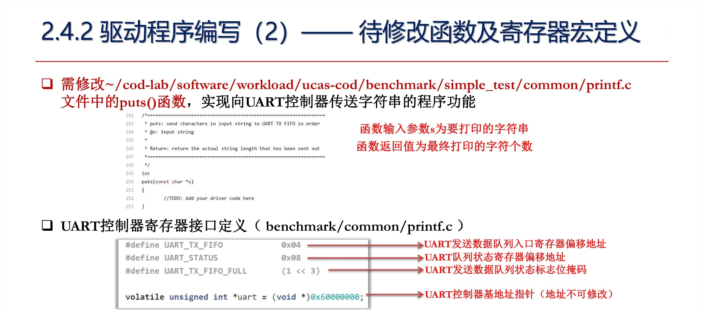
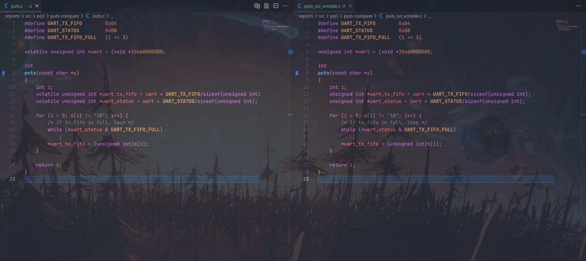

# 实验项目 3 —— 定制 MIPS 功能型处理器设计

## 对讲义中思考题的理解和回答

!!! question
    思考题：图中 `volatile` 关键字的作用是什么？如果去掉会出现什么后果？
    

### 关键字定义

首先，为了了解 `volatile` 关键字含义，我查询了 C11 标准的官方手册，其中这样写道：

>An object that has volatile-qualified type may be modified in ways unknown to the implementation or have other unknown side effects. Therefore any expression referring to such an object shall be evaluated strictly according to the rules of the abstract machine.

翻译为中文就是说：“具有 `volatile` 限定类型的对象可能以实现未知的方式被修改，或具有其他未知的副作用。因此，任何引用此类对象的表达式都必须严格按照抽象机器的规则进行评估。”

### 关键字作用

结合 UART 的描述，我们可以得知，发送队列状态寄存器的值是会实时变化的，而这种变化与程序的行为无关。因此，当我们想要将欲打印的字符写入发送队列时，必须要检查发送队列状态寄存器的实时值，这个值映射到内存的特定地址，所以每当写入一个字符之前，我们要通过访存操作获取 UART_STATUS 的当前值。

关键点是，我们使用 C 语言来撰写驱动程序，而程序的具体行为和编译器密切相关。我们写 C 代码时，需要向编译器传达这样一个信息：“这个 UART_STATUS ，每次判断的时候你必须要老老实实地的去访问内存（即使这样会很慢）。可千万不能为了偷懒只访问一次就草草了事哦”。

正因如此， `volatile` 关键字在这里发挥了至关重要的作用。它告诉编译器：“这个对象变化多端，深不可测。即使多花一些精力也没有关系，必须严格遵守要求，谨慎对待”。

下图给出了在使用和不使用 `volatile` 关键字时， `hello` 样例在 FPGA_eval 中的不同表现，显然，不使用 `volatile` 关键字（图右）的结果是错误的。


### 通过 `puts` 函数探究 `volatile` 具体是怎样影响到 FPGA 结果的

为了搞清楚 `volatile` 具体是怎么影响到结果的，我自己又专门写了两个独立的 C 文件，如下图所示。左侧是用 `volatile` 定义的变量，而右侧没有，除此之外二者没有任何区别。



下面，我在自己电脑上用 `mips-gcc` 交叉编译得到了两个函数的汇编代码，这里我的操作系统环境是 `Ubuntu 22.04.4 LTS on Windows 10 x86_64` ， `mips-gcc` 版本是 10.3.0，为了体现 `volatile` 对编译器的影响，有意使用了  `-O2` 优化。二者的汇编代码展示如图所示:


为了方便阅读，我删去了无关信息，并添加注释来描述每一条汇编指令的具体行为:


通过二者对比，我们不难发现两个重要区别：

#### 区别一：while 的条件判断是否每次都访存


- 在 C 语言中，我们通过检查 STAT_REG 第 3 比特 的值来判断发送队列是否已满。因此，我们需要访问 uart_status 地址处的数据来进行判断。

- 如果使用了 `volatile` ，`while` 循环在每一次循环时都会重新从内存读取数据，然后放到寄存器中和 0 进行比较，这是我们所期望的。

- 如果不使用 `volatile` ，编译器在优化时为了提高效率，只会进行一次访存操作，放到寄存器中。这样每次循环的时候，都会反复读取那个寄存器的值，而不管内存是否变化，这会导致两种后果：
  1. 第一次判断时队列为空，那么之后写入时不会再检查队列是否满（具体原因区别 2 中分析）
  2. 第一次判断时队列为满，则陷入死循环

#### 区别二：程序执行顺序是否符合预期


- 如果不使用 `volatile` ，编译器打乱了程序的执行顺序，区别如下：
  1. 如果使用了 `volatile` ，`bne` 跳转到 `L3`
  2. 如果不使用 `volatile` ，`bne` 跳转到 `L8`

- 注意到，原本 C 代码结构是 `for` 循环嵌套 `while` 循环：

    ```C
        for (i = 0; s[i] != '\0'; i++) {
            while (*uart_status & UART_TX_FIFO_FULL)
                ;
            *uart_tx_fifo = (unsigned int)s[i];
        }
    ```

- 如果不使用 `volatile` ，函数的执行顺序相当于变成了这样：

    ```C
        i = 0;
        while (*uart_status & UART_TX_FIFO_FULL)
            ;
        *uart_tx_fifo = (unsigned int)s[i];
        i++;
        for (i = 1; s[i] != '\0'; i++)
            *uart_tx_fifo = (unsigned int)s[i];
    ```

- 因为 `for` 循环中并没有对地址 `uart_status` 处的值进行修改，在非嵌入式环境的情况下我们有理由认为 `*uart_status` 并没有发生变化，既然这样，就没有必要重复判断了。所以编译器也看似“理所应当”地改变了程序执行的顺序：`for` 循环自从第一次判断结束后，跳转时直接从 `*uart_tx_fifo = (unsigned int)s[i]` 开始执行。

- UART 的 STAT_REG 实际上是会变的，但是因为没有使用 `volatile` 关键字，编译器不知道这一特性，从而在 `-O2` 的过度优化下最终造成了意料之外的结果。
