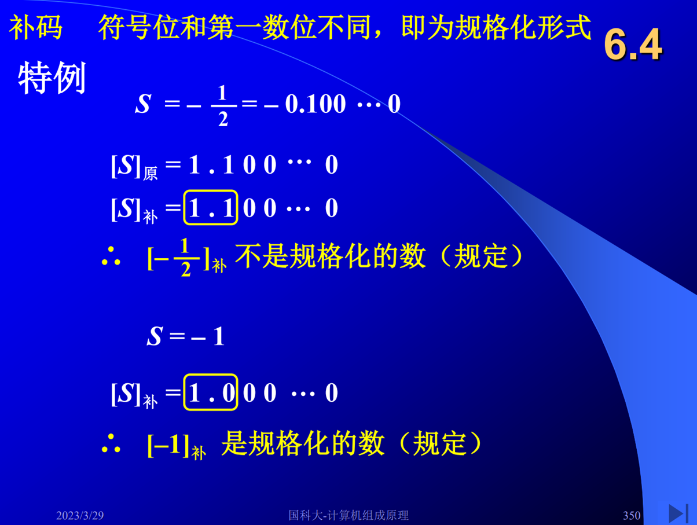
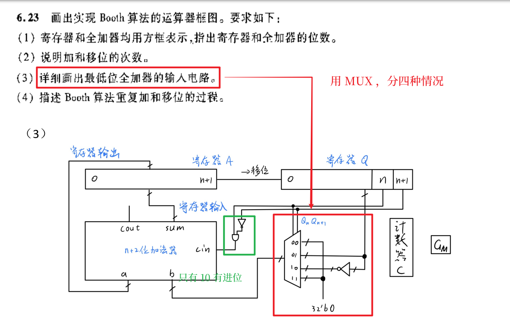
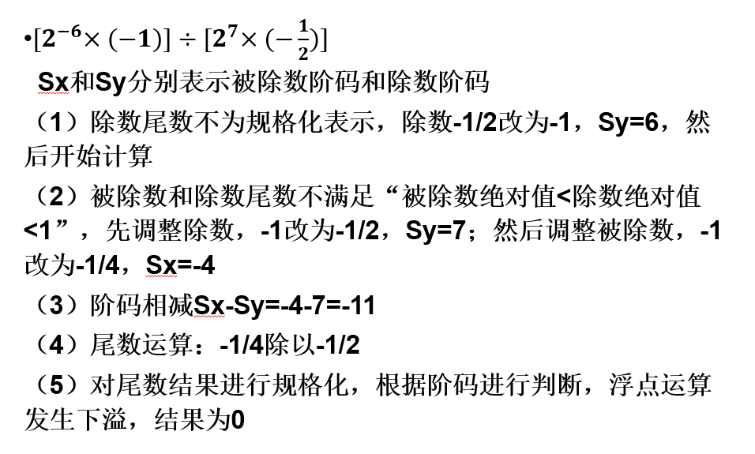
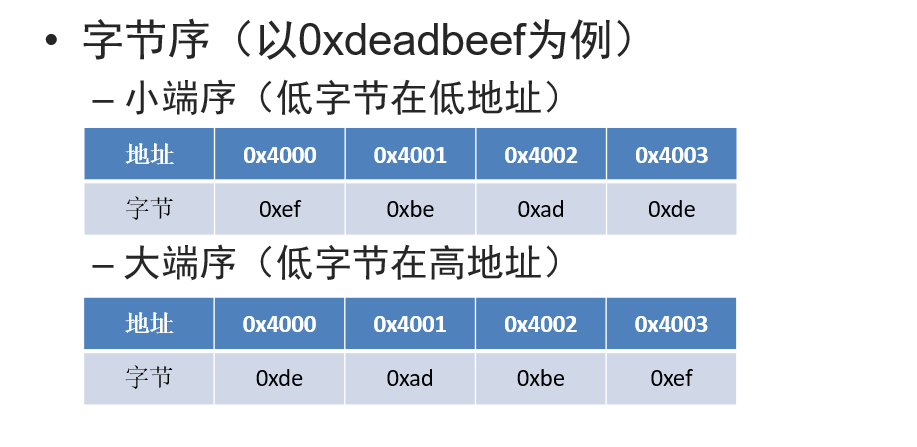

# 国科大 2024 春计算机组成原理课复习

!!! note
    目前更新到期中。。。

## 计算机系统概论

### 冯·诺依曼结构

#### 存储程序

任何要计算机完成的工作都要先被编写成程序，然后将 **程序和原始数据** 送入计算机内部进行存储并启动执行

#### 指令驱动执行

一旦程序被启动，计算机应能在不需操作人员干预下， **自动完成逐条取出指令** 和 **执行指令** 的任务

### 执行一条指令的大致过程（参考作业）

### 几个重要寄存器的位宽

- `PC` 和 `MAR` ：由存储单元地址数量决定
- `IR` ：由指令长度确定
- `MDR` ：由存储字长决定

### 技术指标

- 机器字长，指令字长，存储字长
- 性能评估（MIPS，CPI，主频……）

### 时钟频率，时钟周期，CPI，MIPS关系

- 对于确定处理器和指令实现， **提高主频不会改变 CPI**
- **MIPS 和 CPI 转换公式**
- 主频提高 $\to$ 时钟周期变短，指令执行时间变短 $\to$ MIPS 提高
- CPU 运行不同程序的 CPI 可能不同
- CPI 的单位不是 $\mu \rm{s}$ ，而是时钟周期数

## 计算机中数的表示

### 有符号数与无符号数

### 定点数的表示

!!! note
    有的补码不存在原码，注意不同码制表示范围

- 原码
- 补码
- 反码
- 移码

### 浮点数的表示

#### 规格化数

规律：符号位和第一位不同即可

!!! warning
    负数补码的规格化中，包括 $-1$ （不是全 $1$ ，是 $1.0...0$），不包括 $-\frac{1}{2}$

#### 表示范围

!!! note
    注意机器零，下溢

#### **IEEE 754** 标准

!!! note
    注意规格化数判断标准，单精度和双精度浮点数中，数符、阶码、尾数分别在什么地方要弄清楚，要知道尾数隐含了最高有效位1。

#### 例题

（1）无符号数包括无符号小数

!!! note
    下面注意补码规格化的两个要点
    1. 取最值和原码有区别
    2. 有的值是非规格化的，不可以取

（6）浮点数的阶码 6 位（含 1 位阶符），尾数 10 位（含 1 位数符），正数和负数的表示范围， **原码** 表示。

>最大正数： $0,11111; 0.111111111$
>
>最小正数： $1,11111; 0.000000001$
>
>最大负数： $1,11111; 1.000000001$
>
>最小负数： $0,11111; 1.111111111$

（7）浮点数的阶码 6 位（含 1 位阶符），尾数 10 位（含 1 位数符），采用 **补码规格化** 形式。

>最大正数： $0,11111; 0.111111111$
>
>最小正数： $1,00000; 0.100000000$
>
>最大负数： $1,00000; 1.011111111$
>
>最小负数： $0,11111; 1.000000000$

## 计算机中数的运算

### 移位

!!! note
    符号位怎么移都不会变！！！

!!! warning
    注意丢 0 或丢 1 会出错或精度损失！！！

- 逻辑移位：补零
- 算术移位：考虑符号，码制

### 扩展

- 符号扩展
- 零扩展

### 定点加减法

#### 怎么样用一套加法器实现？

按位取反加 1

!!! question
    为什么要使用一套加法器实现加减运算？

>提高电路复用程度，节省电路面积，降低功耗……

#### 溢出判断

单符号位

双符号位

### 定点乘法运算

- 原码一位乘、两位乘
- Booth 补码一位乘
- 做加法和移位的次数

!!! warning
    注意结果符号位

#### Booth 算法运算器框图

### 定点除法运算

- 原码恢复余数法、原码加减交替除法
- 补码恢复余数法、补码加减交替除法
- 做加法和移位的次数

!!! warning
    注意结果符号位

!!! warning
    第一次上商判溢出

上商判溢出举例：

### 浮点加减运算

- 规格化与对阶
- 溢出判断

### 浮点乘除运算

- 阶码、尾数分别做运算

#### 浮点乘除法运算规则及流程

1. 在进行浮点运算之前，检查两个操作数（被乘数及乘数，被除数及除数）的尾数是否均为规格化表示；如果不是，则需进行规格化
2. 其次，进行浮点运算
    1. 对于乘法，如果发现被乘数的尾数为“-1”，则改为“-1/2”，阶码相应+1（将-1改为-1/2，是因为+1.0不能用补码表示；乘数可以为-1，是因为乘数在运算中只起到决定部分积加[x]补还是[-x]补的作用）；注意，此时是在运算过程中，因此运算过程中的值（例如-1/2）不是规格化是允许的
    2. 对于除法，需保证“被除数绝对值<除数绝对值<1”，否则应进行尾数调整，使得尾数除法不溢出。注意，此时是在运算过程中，因此运算过程中的值（例如-1/2）不是规格化是允许的
    3. 阶码运算：若阶码采用补码表示，则乘法时阶码相加、除法时阶码相减
    4. 进行尾数的零判断：乘法中若一个尾数为0则乘积为0、除法中若被除数为0则商为0、除法中若除数为0则商为无穷大，结束运算
    5. 尾数运算：两个尾数相乘或相除
3. 尾数运算结果规格化（乘法时需考虑舍入处理），同时根据阶码判断浮点运算结果是否溢出（注意：完成运算，进行规格化之后，再判断溢出）

## 指令系统

### 机器指令

指令格式

### 寻址方式（指令寻址与数据寻址）

!!! warning
    立即寻址和直接寻址是不同的，立即寻址就是一个立即数，不需要访问内存或通用寄存器即可获得操作数，直接寻址需要进行一次访存。

!!! note
    不同的寻址方式有哪些合适的用途

!!! note
    存储部件是按照字节编址还是按照字编址，或其他的编址方式

- 立即 or 直接？
- 隐含
- 间接
- 寄存器
- 寄存器间接
- 基址
- 变址

### 字节序

大端序和小端序

#### 边界对齐

K字节大小的数据必须存放在K的整数倍地址

## 单周期处理器

### 数据通路

- 取指、译码、执行、访存、写回
- 数据从哪里来，到哪里去
- 例如：一条加法指令，源操作数从寄存器获得，经过ALU运算后，结果又写入寄存器

### 控制信号

!!! note
    对照着讲义上的单周期处理器框图，把不同类型指令在单周期处理器上的完整执行过程弄清楚。

- 决定处理器做什么操作
- PC更新为PC+4还是分支地址
- ALU做什么运算
- 是否写寄存器
- ……
