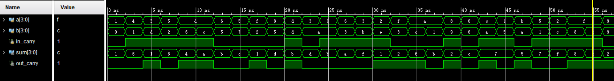
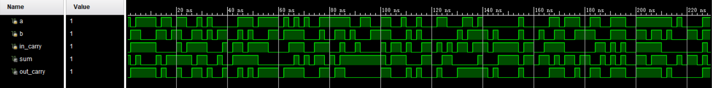

# REPORT 1 熟悉 Vivado 环境

## 实验目的

1. 熟悉 vivado 设计流程
2. 掌握利用 vivado 创建设计的方法（以实现 4 位加法器为例）
3. 掌握编写 testbench 的方法，以及行为仿真方法
4. 利用所掌握的知识, 完成以下两道附加题:
    1. 用结构级描述编写一个 1 位加法器,并进行仿真
    2. 设计电路实现以下目的: 输入一个 32 位二进制数, 并输出一个 5 位二进制数用来描述该 32 位数字第一个出现 "1" 的位置(从低位开始计数, 从 0 开始)

## 实验环境

|  操作系统  | Vivado 版本 |  FPGA 器件芯片型号  |
| :--------: | :---------: | :-----------------: |
| Windows 11 |   2017.1    | xc7vx485tffg 1157-1 |

## 原理说明

### Vivado 设计流程

1. 在 Vivado 中创建 RTL 文件
2. 进行 HDL 语言编写
3. 设置激励仿真
4. 综合, 实现
5. 生成 bit 文件下载到 FPGA

### 例题: 4 位加法器

1. 首先明确输入和输出. 4 位加法器的输入为两个 4 位二进制数和一个进位信号, 分别定义为 in_0, in_1 和 cin ; 输出为一个 4 位二进制数和一个进位信号, 分别定义为 out 和 cout.
2. 写出逻辑表达式, 以行为级描述的方式实现 4 位加法器.

### 附加题1: 1 位加法器

1. 首先明确输入和输出. 1 位加法器的输入为两个 1 位二进制数和一个进位信号, 分别定义为 in_0, in_1 和 cin ; 输出为一个 1 位二进制数和一个进位信号, 分别定义为 out 和 cout.
2. 自己在草稿纸上绘出逻辑电路图, 以结构级描述的方式实现 1 位加法器.

### 附加题2: 32 位二进制数第一个出现 "1" 的位置

1. 首先明确输入和输出. 输入为一个 32 位二进制数, 定义为 in ; 输出为一个 5 位二进制数, 定义为 out.
2. 写出逻辑表达式, 以行为级描述的方式实现

## 接口定义

### 例题: 4 位加法器

```Verilog
module add_4(
    input  [3:0] in_0,
    input  [3:0] in_1,
    input        cin,
    output [3:0] out,
    output       cout
);
```

### 附加题1: 1 位加法器

```Verilog
  module add_4(
    input  in_0,
    input  in_1,
    input  cin,
    output out,
    output cout
    );
```

### 附加题2: 32 位二进制数第一个出现 "1" 的位置

```Verilog
module hw(
    input  [31:0] in,
    output [ 4:0] out
);
```

## 调试过程及结果

### 例题: 4 位加法器



### 附加题1: 1 位加法器



### 附加题2: 32 位二进制数第一个出现 "1" 的位置


## 实验总结

- 本次实验课是我第一次用硬件描述语言语言完成电路设计, 并通过 Testbench 进行仿真. 在这个过程中我熟悉了 Vivado 的使用方法, 也对 Verilog 语言有了初步的了解. 和作为编程语言的 C 语言相比, 硬件描述语言最大的不同在于它是各个模块并行运作的, 此外, Verilog 语言还培养了我的模块化思维, 这对于我以后深入理解计算机学科相关知识打下了坚实的根基.
- 通过 4 位加法器和 1 位加法器, 我分别熟悉了模块的行为级描述和结构化描述方式. 而最后一个附加题通过让我自己设计电路, 进一步帮助我加深理解, 我因此提高了自己独立思考和动手实践的能力, 受益匪浅.

## 源代码

### 例题: 4 位加法器

#### 设计文件

```Verilog
module add_4(
    //input/output signals and defination
    input  [3:0] in_0,
    input  [3:0] in_1,
    input        cin,
    output [3:0] out,
    output       cout
);
    // assignment statement
    assign {cout, out} = in_0 + in_1 + cin;
endmodule
```

#### 激励测试文件

```Verilog
module test_add_4();
    reg  [3:0] a;
    reg  [3:0] b;
    reg        in_carry;
    wire [3:0] sum;
    wire       out_carry;
    //instantiate aninitial object of module add_4
    add_4 instance_add_4 (
        .in_0(a),
        .in_1(b),
        .cin(in_carry),
        .out(sum),
        .cout(out_carry)
    );
    initial begin
        a = 4'h1;
        b = 4'h0;
        in_carry = 1'b0;
    end
    always begin
        #2;
        a = $random() % 16;
        b = $random() % 16;
        in_carry = $random() % 2;
    end
endmodule
```

### 附加题1: 1 位加法器

#### 设计文件

```Verilog
module add_1(out, cout, in_0, in_1, cin);
    input   in_0, in_1, cin;
    output  out, cout;
    wire w1, w2, w3, w4;
    xor ( w1, in_0, in_1),
        ( out, w1, cin);
    and ( w2, in_0, in_1),
        ( w3, in_0, cin),
        ( w4, in_1, cin);
    or  ( cout, w2, w3, w4);
endmodule
```

#### 激励测试文件

```Verilog
module test_add_1();
    reg  a;
    reg  b;
    reg  in_carry;
    wire sum;
    wire out_carry;
    add_1 instance_add_1 (
        .in_0(a),
        .in_1(b),
        .cin(in_carry),
        .out(sum),
        .cout(out_carry)
    );
    initial begin
        a = 1'h1;
        b = 1'h0;
        in_carry = 1'b0;
    end
    always begin
        #2;
        a = $random() % 2;
        b = $random() % 2;
        in_carry = $random() % 2;
    end
endmodule
```

### 例题: 4 位加法器

#### 设计文件

```Verilog
module hw(
    input  [31:0] in,
    output [ 4:0] out
);
    reg [4:0] i;
    always @(*) begin
        for(i=0; in[i]==0; i=i+1) begin
        end
    end
    assign out=i;
endmodule
```

#### 激励测试文件

```Verilog
module hw_test();
    reg  [31:0] in;
    wire [ 4:0] out;
    hw instance_hw(
        .in(in),
        .out(out)
    );
    initial begin
    in = 32'h1;
    end
    always begin
        #2;
        in = $random() % 2^32;
    end
endmodule
```
