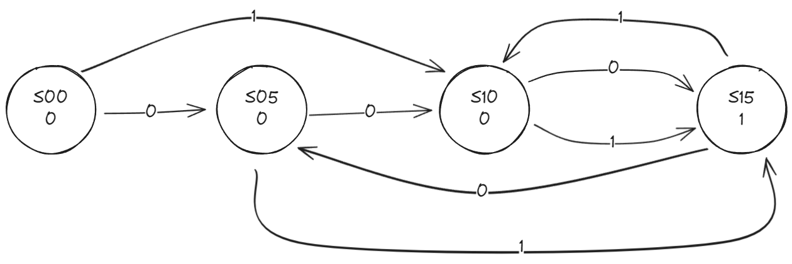
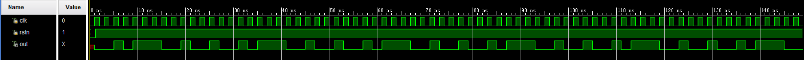

# REPORT 3 状态机实验

## 实验目的

1. 熟悉 vivado 编程, 调试;
2. 熟悉状态机的工作原理, 能熟练编写状态机程序.

## 实验环境

|  操作系统  | Vivado 版本 |  FPGA 器件芯片型号  |
| :--------: | :---------: | :-----------------: |
| Windows 11 |   2017.1    | xc7vx485tffg 1157-1 |

## 原理说明

### **0110** 序列检测器

- 状态图:


- 说明:
  - 一个圆圈表示一个状态, 圆圈内有两行文本, 第一行表示状态名, 第二行表示该状态对应输出信号. 例如, 最左边圆圈中内容表示状态 `S0` , 当状态机处于该状态时会输出信号 **0** ;
  - 每个箭头从一个圆圈指向另一个圆圈, 表示状态之间的转换. 箭头上的数字表示该转换的条件, 这里是输入信号. 例如, 从 `S0` 指向 `S1` 的箭头上标有数字 **0** , 表示当状态机处于状态 `S0` 的时候, 输入信号 **0** , 状态机会跳转到 `S1` ;
  - 本题中状态机的输出由状态机本身所处状态决定, 与输入无关, 因此可以将输出信号和状态写在同一个圆圈内. 输入信号有 **0** 和 **1** 两种, 所以每一个圆圈出发有两条箭头.

### **11011** 序列检测器

- 状态图:


- 说明:
  - 设计思路与规范和上文相同, 不再赘述;
  - 差别在于序列的不同, 画出状态转移图即可.

### **0010111001001** 序列信号发生器

- 说明:
  - 本题通过循环移位寄存器实现, 无状态转移图;
  - 在模块内定义 `reg [12:0] seq`  , 并赋初始值为 **0010111001001** ;
  - 每当 `clk` 上升沿到来时, 将 `seq` 左移一位, 并把左边多出来的那一位补到最右侧 (注意一定要用 `<=` 非阻塞赋值的方式完成这一操作);
  - 每次输出 `out = seq[12]` 即可.

### 报纸售卖机

- 状态图:



- 说明:
  - 首先对问题建模:
    - 状态: 以售卖机中储存的硬币金额为依据, 定义状态机的 4 个状态分别为 `S00`, `S05` , `S10` 和 `S15` (之所以设置 `S15` 是为了和 `S00` 做区分, `S00` 是初始值的零状态, 输出的打印信号为 **0** , 而 `S15` 描述了所付金额达到报纸价格后归零的状态, 输出的打印信号为 **1**). 其中, `S05` 表示目前售卖机已经投入硬币的金额为 5 分;
    - 输入/输出: 与序列检测器相同, 状态下方为输出信号 `newspaper` , 剪头上的信号为 输入信号 `coin` :
      - `coin` : **0** 表示投入 5 分硬币, **1** 表示投入 1 角硬币;
      - `newspaper` : **0** 表示不打印报纸, **1** 表示打印报纸;
  - 然后画出状态转移图:
    - 定义上文已述. 例如, 对于从 `S05` 指向 `S15` 的标有 **1/1** 的箭头, 表示当售卖机已经投入硬币金额为 5 分时, 若再投入一枚 1 角硬币, 售卖机储存金额数变为 15 分, 并打印一张报纸.

## 接口定义

### **0110** 序列检测器

| 输入端口            |      | 输出端口       |      |
| ------------------- | ---- | -------------- | ---- |
| `clk` (时钟信号)      | 1bit | `out` (检测结果) | 1bit |
| `rstn` (同步置位信号) | 1bit |                |      |
| `in` (输入信号)       | 1bit |                |      |

### **11011** 序列检测器

| 输入端口            |      | 输出端口       |      |
| ------------------- | ---- | -------------- | ---- |
| `clk` (时钟信号)      | 1bit | `out` (检测结果) | 1bit |
| `rstn` (同步置位信号) | 1bit |                |      |
| `in` (输入信号)       | 1bit |                |      |

### **0010111001001** 序列信号发生器

| 输入端口            |      | 输出端口       |      |
| ------------------- | ---- | -------------- | ---- |
| `clk` (时钟信号)      | 1bit | `out` (输出序列信号) | 1bit |
| `rstn` (同步置位信号) | 1bit |                |      |

### 报纸售卖机

| 输入端口            |      | 输出端口       |      |
| ------------------- | ---- | -------------- | ---- |
| `clk` (时钟信号)      | 1bit | `newspaper` (是否打印报纸: 1 代表"是", 0 代表"否") | 1bit |
| `rstn` (同步置位信号) | 1bit |                |      |
| `coin` (投入硬币: 0 代表 5 分, 1 代表 1 角)       | 1bit |                |      |

## 调试过程及结果

### **0110** 序列检测器


### **11011** 序列检测器


### **0010111001001** 序列信号发生器



### 报纸售卖机


## 实验总结

- 本次实验主要完成了状态机的设计. 正式实验首先要求以 `0110` 序列检测器的状态图为例, 完成 verilog 代码设计. 并举一反三, 独立设计 `11011` 序列检测器 (包括状态转移图以及 verilog 源码). 在完成正式实验的基础上, 可以继续尝试序列信号发生器和报纸售卖机的设计. 本次实验所有 testbench 文件均由自己编写.
- 正式实验中, 进一步熟悉了时序电路设计的一般流程: 先根据需求画出对应的状态转移图, 然后用 verilog 代码实现.
  - 状态转移图令我想到了大一下计科导课程学到的图灵机, 都是对实际问题建模, 明确状态机涉及到的几种不同状态, 弄清楚每一种状态对应的条件, 以及其对应的不同输入输出信号, 最后以图像形式简洁明了地进行刻画.
  - 编辑 verilog 源码的过程中, 我使用了老师推荐的 "三段式" 描述, 将时钟信号, 状态转移以及输出信号分为三部分编写, 简洁而又清晰. 内容上, 我学习到 `always` 模块的用法, 并了解到电平触发信号和边沿触发信号 (包括上升沿 `posedge` 和下降沿 `negedge`) 作为判断条件在 verilog 语言中的具体实现方式. 此外, 我还学习了 `<=` (非阻塞赋值) 和 `=` (阻塞赋值) 的区别.
- 通过先前和学长的交流, 本次附加实验 1 (序列信号发生器) 没有采用状态机的方法, 而是改用循环移位寄存器来实现. 一方面, 使用状态机描述一共需要设定 13 种状态, 延迟较高, 源码的空间复杂度很大; 另一方面, 移位寄存器充分发挥了寄存器的用途, 用极简的代码实现了更高效的结果, 更接近计算机本身的工作方式.
- 附加实验 2 则需要对实际问题进行分析. 利用抽象思维, 用售卖机已经投入的钱币金额来描述状态, 投入的硬币种类规定为输入, 是否打印报纸作为输出. 这样即可画出状态转移图, 并用 verilog 代码完成实现.
- 在这个过程中, 我不仅对旧知识进行了回顾, 也对状态机有了更深刻的理解, 这对我相关课程的学习打下了坚实的基础.

## 源代码

### **0110** 序列检测器

- 设计文件:

```Verilog
module sequencing0110(
    input           clk,
    input           rstn,
    input           in,
    output      reg out
);

    localparam S0 = 3'b000;
    localparam S1 = 3'b001;
    localparam S2 = 3'b010;
    localparam S3 = 3'b011;
    localparam S4 = 3'b100;

    reg [3:0] state;
    reg [3:0] next_state;

    always @(negedge rstn or posedge clk) begin
        if (!rstn) begin
            state <= S0;
        end
        else begin
            state <= next_state;
        end
    end

    always @(state or in) begin
        case(state)
        S0: begin
            next_state =  in ? S0 : S1;
        end
        S1: begin
            next_state =  in ? S2 : S1;
        end
        S2: begin
            next_state =  in ? S3 : S1;
        end
        S3: begin
            next_state =  in ? S0 : S4;
        end
        S4: begin
            next_state =  in ? S2 : S1;
        end
        default: next_state = S0;
        endcase
    end

    always @(state) begin
        case(state)
        S0:out = 1'b0;
        S1:out = 1'b0;
        S2:out = 1'b0;
        S3:out = 1'b0;
        S4:out = 1'b1;
        default: out = 1'bx;
        endcase
    end
endmodule
```

- 测试激励文件:

```Verilog
module test_sequencing0110(
);
    reg         clk;
    reg         rstn;
    reg         in;
    wire        out;

    sequencing0110 sequencing0110_inst_0 (
        .clk(    clk),
        .rstn(  rstn),
        .in(      in),
        .out(    out)
    );

    initial begin
        clk  = 0;
        rstn = 1;
        in   = 1;
        #0.1 rstn = 0;
        #1.1 rstn = 1;
    end

    always begin
        #1 clk = ~clk;
    end

    always begin
        #2 in = $random() % 2;
    end
endmodule
```

### **11011** 序列检测器

- 设计文件:

```Verilog
module sequencing11011(
    input           clk,
    input           rstn,
    input           in,
    output      reg out
);

    localparam S0 = 3'b000;
    localparam S1 = 3'b001;
    localparam S2 = 3'b010;
    localparam S3 = 3'b011;
    localparam S4 = 3'b100;
    localparam S5 = 3'b101;

    reg [3:0] state;
    reg [3:0] next_state;

    always @(negedge rstn or posedge clk) begin
        if (!rstn) begin
            state <= S0;
        end
        else begin
            state <= next_state;
        end
    end

    always @(state or in) begin
        case(state)
        S0: begin
            next_state =  in ? S1 : S0;
        end
        S1: begin
            next_state =  in ? S2 : S0;
        end
        S2: begin
            next_state =  in ? S2 : S3;
        end
        S3: begin
            next_state =  in ? S4 : S0;
        end
        S4: begin
            next_state =  in ? S5 : S0;
        end
        S5: begin
            next_state =  in ? S2 : S3;
        end
        default: next_state = S0;
        endcase
    end

    always @(state) begin
        case(state)
        S0:out = 1'b0;
        S1:out = 1'b0;
        S2:out = 1'b0;
        S3:out = 1'b0;
        S4:out = 1'b0;
        S5:out = 1'b1;
        default: out = 1'bx;
        endcase
    end
endmodule
```

- 测试激励文件:

```Verilog

module test_sequencing11011(
);
    reg         clk;
    reg         rstn;
    reg         in;
    wire        out;

    sequencing11011 sequencing11011_inst_0 (
        .clk(    clk),
        .rstn(  rstn),
        .in(      in),
        .out(    out)
    );

    initial begin
        clk  = 0;
        rstn = 1;
        in   = 1;
        #0.1 rstn = 0;
        #1.1 rstn = 1;
    end

    always begin
        #1 clk = ~clk;
    end

    always begin
        #2 in = $random() % 2;
    end
endmodule

```

### **0010111001001** 序列信号发生器

- 设计文件:

```Verilog
module seq(
    input           clk,
    input           rstn,
    output          out
);

    reg [12:0] seq;

    always@(posedge clk)begin
        if (!rstn) begin
            seq <= 13'b0010111001001;
        end
        else begin
            seq <= {seq[11:0], seq[12]};
        end
    end

    assign out = seq[12];
endmodule
```

- 测试激励文件:

```Verilog
module test_seq(
);
    reg         clk;
    reg         rstn;
    wire        out;

    seq seq_inst_0 (
        .clk(    clk),
        .rstn(  rstn),
        .out(    out)
    );

    initial begin
        clk  = 0;
        rstn = 1;
        #0.1 rstn = 0;
        #1.1 rstn = 1;
    end

    always begin
        #1 clk = ~clk;
    end
endmodule

```

### 报纸售卖机

- 设计文件:

```Verilog
module newspaper(
    input           clk,
    input           rstn,
    input           coin,
    output      reg newspaper
);

    localparam S00 = 2'b00;
    localparam S05 = 2'b01;
    localparam S10 = 2'b10;
    localparam S15 = 2'b11;

    reg [1:0] state;
    reg [1:0] next_state;

    always @(negedge rstn or posedge clk) begin
        if (!rstn) begin
            state <= S00;
        end
        else begin
            state <= next_state;
        end
    end

    always @(state or coin) begin
        case(state)
        S00: begin
            next_state = coin ? S10 : S05;
        end
        S05: begin
            next_state = coin ? S15 : S10;
        end
        S10: begin
            next_state = S15;
        end
        S15: begin
            next_state = coin ? S10 : S05;
        end
        default: next_state = S00;
        endcase
    end

    always @(state) begin
        case(state)
        S00:        newspaper = 1'b0;
        S05:        newspaper = 1'b0;
        S10:        newspaper = 1'b0;
        S15:        newspaper = 1'b1;
        default:    newspaper = 1'bx;
        endcase
    end
endmodule
```

- 测试激励文件:

```Verilog
module test_newspaper(
);
    reg         clk;
    reg         rstn;
    reg         coin;
    wire        newspaper;

    newspaper newspaper_inst_0 (
        .clk(                 clk),
        .rstn(               rstn),
        .coin(               coin),
        .newspaper(     newspaper)
    );

    initial begin
        clk  = 0;
        rstn = 1;
        coin   = 1;
        #0.1 rstn = 0;
        #1.1 rstn = 1;
    end

    always begin
        #1 clk = ~clk;
    end

    always begin
        #2 coin = $urandom() % 3;
    end
endmodule
```
