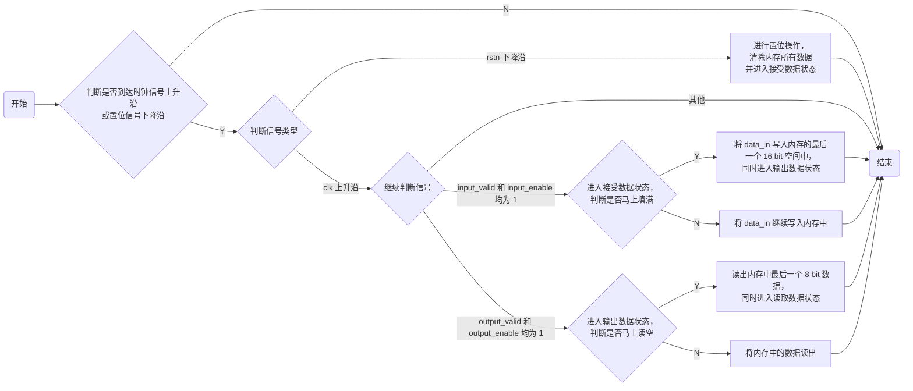
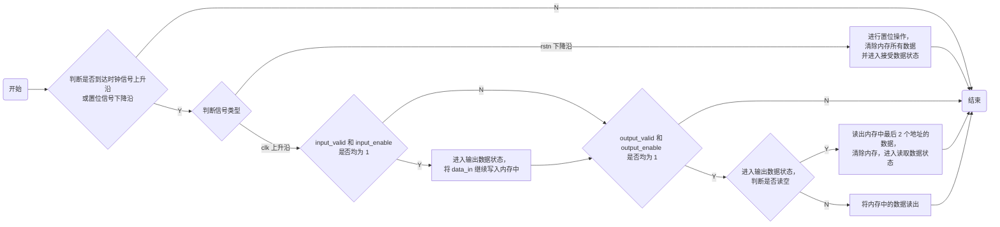
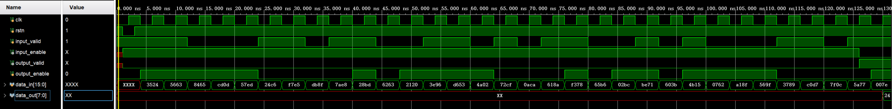
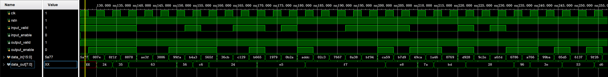
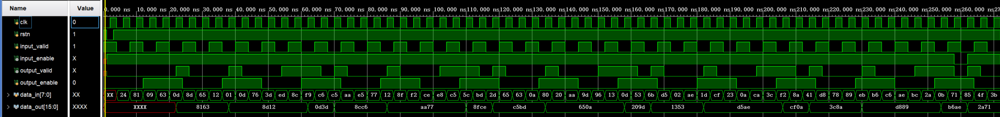

# REPORT 4 FIFO 实验

## 实验目的

- 熟悉 `Verilog` 编程、调试

- 熟悉 FIFO 工作原理

- 实现功能较复杂的数字电路

## 实验环境

|  操作系统  | Vivado 版本 |  FPGA 器件芯片型号  |
| :--------: | :---------: | :-----------------: |
| Windows 11 |   2019.2    | xc7vx485tffg 1157-1 |

## 原理说明

### 正式实验

#### 流程图



#### 说明

1. 在 `input` 状态下，当写到第 30 个地址时认为写满（因为一个地址储存 8 bit 数据，每次写入两个地址，即 16 bit）；

   同理，在 `output` 状态下，读到第 31 个地址时认为读空。

2. 本实验全程使用 **非阻塞赋值** ，所以在读 / 写到最后一个地址时，就应该转换 `input_enable` / `output_valid` 信号，并同时完成最后一个读 / 写操作，而不是等到读 / 写完后。

### 附加实验

#### 流程图



#### 说明

1. 和上一实验相比，本实验有两个最大区别：首先是输入输出的**端口位宽发生了改变**，其次是**读取规则**的变化。

2. 读出 16 bit 数据的时候，是把先写入的 8 bit 数据放在读出数据的高 8 位，还是把它放在低 8 位，讲义没有说清楚。我的处理方法是放在高 8 位（方便阅读），接下来我们重点关注读取规则是怎样变化的。

3. 在本实验中，读写之所以能同时进行，是因为出现了 `input_enable` 和 `output_valid` 可以同时为 1 的情景。因此，我们首先需要修改 `input_enable` 和 `output_valid` 的赋值规则：

   1. 对于 `input_enable`  信号，初始化为 1，写满时赋值为 0，读空时又赋值为 1。

   2. 而对于 `output_valid`  信号，只要内存中存在还没有读出的数据，都应该赋值为 1。因此，我们需要对该信号的赋值指定一个特定的规则，下面是具体实现方式：

      ```Verilog
      module fifo2(...);
        ...
        wire output_v;
        assign output_v = (write_addr - read_addr >= 2)? 1'b1 : 1'b0;
        ...
        always @(posedge clk or negedge rstn) begin
        output_valid <= output_v;
        ...
        end
      endmodule
      ```

      关于 `write_addr` 和 `read_addr` 的定义，与老师所给示例相同，不再赘述。

      我的处理方法是在模块中自定义了一个  `wire` 型变量 `output_v` 。这样做有一个好处， `wire` 型变量能够根据它的定义实时变化，因此在每个循环中，它能够立刻检测出是否还能读出数据。当内存中存在未读出数据的时候，一旦外界传来  `output_enable` 信号，就可以立刻读出。不然等到内部  `output_valid` 信号改变的时候，外部的 `output_enable` 信号已经不是原来的信号了。

4. 除此之外，为了能使得 FIFO 能在读空后从头开始工作，我还对一个地方进行了小修改：

   ```Verilog
   if (write_addr == 31) begin
       input_enable   <= 1'b0;
       write_addr     <= 5'b0;  // 注意这里
       mem[31][ 7: 0] <= data_in[ 7: 0];
   end
   else begin
       write_addr             <= write_addr + 1;
       mem[write_addr][ 7: 0] <= data_in[ 7: 0];
   end
   ```

   这里修改了读入位置的判断，这是和正式实验不一样的地方。此处， `write_addr` 在值等于 31 后将其重新赋值为 0。因为它的定义是 5 位无符号二进制数，所以在这种情况下 `write_addr` 和 `read_addr` 的差值仍然是合法的，同样可以返回出未读出数据所占空间的大小，能保证 `write_addr - read_addr >= 2` 依然适用。

   如果按照正式实验的规则， `write_addr == 31`  后保持不变的话，那么当 `read_addr == 30` 的时候，因为 `write_addr - read_addr == 1` ，导致虽然内存中还剩最后 2 个地址中的数据，但读不出来。

##  接口定义

### 正式实验

| 输入端口                         | 位宽 | 输出端口                        | 位宽 |
| -------------------------------- | :--: | ------------------------------- | :--: |
| `clk` （时钟信号）               |  1   |                                 |      |
| `rstn` （同步置位信号）          |  1   |                                 |      |
| `input_valid` （输入有效信号）   |  1   | `input_enable` （输入使能信号） |  1   |
| `output_enable` （输出使能信号） |  1   | `output_valid` （输出有效信号） |  1   |
| `data_in` （数据输入端口）       |  16  | `data_out` （数据输出端口）     |  8   |

### 附加实验

| 输入端口                         | 位宽 | 输出端口                        | 位宽 |
| -------------------------------- | :--: | ------------------------------- | :--: |
| `clk` （时钟信号）               |  1   |                                 |      |
| `rstn` （同步置位信号）          |  1   |                                 |      |
| `input_valid` （输入有效信号）   |  1   | `input_enable` （输入使能信号） |  1   |
| `output_enable` （输出使能信号） |  1   | `output_valid` （输出有效信号） |  1   |
| `data_in` （数据输入端口）       |  8   | `data_out` （数据输出端口）     |  16  |

## 调试过程及结果

### 正式实验

波形图如下：





### 附加实验

波形图如下：



## 实验总结

- 通过本次实验，我学习到了有关 `memory`  的知识。之前在课堂上对计算机存储数据的方式有了大致的了解，但只有亲手操作后，才更加深刻地体会到计算机的工作原理。这也是我第一次接触到 `enable` （使能）信号，并将其和 `valid` （有效）信号加以区分，了解到它们各自的用途。

- 此外，我还对 **阻塞赋值** 和 **非阻塞赋值** 有了一个全新的认识。在附加实验中，我起初通过一个简单的 **阻塞赋值** ，轻松完成了目标：

  ```Verilog
  if (write_addr - read_addr >= 2) begin
      output_valid = 1'b1;
  end
  else begin
      output_valid = 1'b0;
  end
  ```

  这是我一开始的思路，因为这样可以保证在内存中存在未读出数据的时候，一旦外界给定的 `output_enable` 信号为真，立马就能将数据读出（如果采用非阻塞赋值，那么等到 `output_valid`  信号更新的时候， `output_enable` 信号已经改变了）。

  但通过查阅资料和老师以往讲义得知，这种做法虽然在本实验适用，但是在时序逻辑设计中应该尽量避免，因为在不同编译环境中会造成不可预测的结果。


- 于是我换了好几次思路，其中一个思路是：对当前当前循环结束后的 `write_addr` 和 `read_addr` 的差值做一个**预测**，并将四种不同预测情况的结果（是本次循环结束后的 `write_addr` 和 `read_addr` 预测值，不是当前值）和 2 进行比较（之所以和 2 比是因为一次读出连续 2 个地址中的内容），作为给 `output_valid` 赋值的判断条件。但是这样写不仅代码量巨大，而且硬件层面也会占据巨量资源，后来还是弃用了。

- 最终是自定义了一个  `wire` 型变量 `output_v` 来解决问题。我也因此学习到 `wire` 型变量的全新用法：在时序逻辑中，如果出现非阻塞赋值解决不了的问题时，可以借助 `wire` 型变量来巧妙化解。

## 源代码

### 正式实验

#### 设计文件

```Verilog
module fifo(
    input               clk,
    input               rstn,
    input               input_valid,
    input               output_enable,
    output reg          input_enable,
    output reg          output_valid,
    input       [15: 0] data_in,
    output reg  [ 7: 0] data_out
);

    reg [ 7: 0] mem [31: 0];
    reg [ 4: 0] write_addr;
    reg [ 4: 0] read_addr;

    always @(posedge clk or negedge rstn) begin
        if (rstn == 0)begin
            write_addr       <= 5'b0;
            read_addr        <= 5'b0;
            input_enable     <= 1'b1;
            output_valid     <= 1'b0;
            data_out[ 7:0]   <= 8'bxxxxxxxx;
        end
        else begin
            if ((input_valid == 1'b1) && (input_enable == 1'b1)) begin
                if (write_addr == 30) begin
                    input_enable   <= 1'b0;
                    output_valid   <= 1'b1;
                    write_addr     <= 5'b0;
                    mem[30][ 7: 0] <= data_in[ 7: 0];
                    mem[31][ 7: 0] <= data_in[15: 8];
                end
                else begin
                    write_addr                 <= write_addr + 2;
                    mem[write_addr][ 7: 0]     <= data_in[ 7: 0];
                    mem[write_addr + 1][ 7: 0] <= data_in[15: 8];
                end
            end
            else if (output_valid == 1'b1 && output_enable == 1'b1) begin
                if (read_addr == 31) begin
                    input_enable    <= 1'b1;
                    output_valid    <= 1'b0;
                    read_addr       <= 5'b0;
                    data_out[ 7: 0] <= mem[31][ 7: 0];
                end
                else begin
                    read_addr       <= read_addr + 1;
                    data_out[ 7: 0] <= mem[read_addr][ 7: 0];
                end
            end
            else begin
            end
        end
    end
endmodule
```

#### 激励测试文件

```Verilog
module fifo_test(
);
    reg          clk;
    reg          rstn;
    reg          input_valid;
    wire         input_enable;
    wire         output_valid;
    reg          output_enable;
    reg  [15: 0] data_in;
    wire [ 7: 0] data_out;

    fifo inst_fifo_0(
        .clk(                       clk),
        .rstn(                     rstn),
        .input_valid(       input_valid),
        .input_enable(     input_enable),
        .output_valid(     output_valid),
        .output_enable(   output_enable),
        .data_in(               data_in),
        .data_out(             data_out)
    );

    always #2 begin
        clk = ~clk;
    end

    initial begin
        clk           = 1'b0;
        rstn          = 1'b1;
        input_valid   = 1'b1;
        output_enable = 1'b0;
        #1 rstn = 1'b0;
        #2 rstn = 1'b1;
    end

    always begin
        #4;
        data_in = $random() % 17'b1_00000000_00000000;
    end

    always begin
        #4;
        input_valid   = $random() % 2'b10;
        output_enable = $random() % 2'b10;
    end
endmodule
```

### 附加实验

#### 设计文件

```Verilog
module fifo2(
    input               clk,
    input               rstn,
    input               input_valid,
    input               output_enable,
    output reg          input_enable,
    output reg          output_valid,
    input       [ 7: 0] data_in,
    output reg  [15: 0] data_out
);

    reg [ 7: 0] mem [31: 0];
    reg [ 4: 0] write_addr;
    reg [ 4: 0] read_addr;
    wire output_v;

    assign output_v = (write_addr - read_addr >= 2)? 1'b1 : 1'b0;

    always @(posedge clk or negedge rstn) begin
        output_valid <= output_v;
        if (rstn == 0)begin
            write_addr     <= 5'b0;
            read_addr      <= 5'b0;
            input_enable   <= 1'b1;
            output_valid   <= 1'b0;
            data_out[ 7:0] <= 8'bxxxxxxxx;
        end
        else begin
            if ((input_valid == 1'b1) && (input_enable == 1'b1)) begin
                if (write_addr == 31) begin
                    input_enable   <= 1'b0;
                    write_addr     <= 5'b0;
                    mem[31][ 7: 0] <= data_in[ 7: 0];
                end
                else begin
                    write_addr             <= write_addr + 1;
                    mem[write_addr][ 7: 0] <= data_in[ 7: 0];
                end
            end
            if (output_v == 1'b1 && output_enable == 1'b1) begin
                if (read_addr == 30) begin
                    input_enable    <= 1'b1;
                    output_valid    <= 1'b0;
                    read_addr       <= 5'b0;
                    data_out[ 7: 0] <= mem[31][ 7: 0];
                    data_out[15: 8] <= mem[30][ 7: 0];
                end
                else begin
                    read_addr       <= read_addr + 2;
                    data_out[ 7: 0] <= mem[read_addr + 1][ 7: 0];
                    data_out[15: 8] <= mem[read_addr][ 7: 0];
                end
            end
            else begin
            end
        end
    end
endmodule
```

#### 激励测试文件

```Verilog
module fifo2_test(
);
    reg          clk;
    reg          rstn;
    reg          input_valid;
    wire         input_enable;
    wire         output_valid;
    reg          output_enable;
    reg  [ 7: 0] data_in;
    wire [15: 0] data_out;

    fifo2 inst_fifo2_0(
        .clk(                       clk),
        .rstn(                     rstn),
        .input_valid(       input_valid),
        .input_enable(     input_enable),
        .output_valid(     output_valid),
        .output_enable(   output_enable),
        .data_in(               data_in),
        .data_out(             data_out)
    );

    always #2 begin
        clk = ~clk;
    end

    initial begin
        clk           = 1'b0;
        rstn          = 1'b1;
        input_valid   = 1'b1;
        output_enable = 1'b0;
        #1 rstn = 1'b0;
        #2 rstn = 1'b1;
    end

    always begin
        #4;
        data_in = $random() % 9'b1_0000_0000;
    end

    always begin
        #4;
        input_valid   = ~input_valid;
    end

    always begin
        #12;
        output_enable = ~output_enable;
    end
endmodule
```
