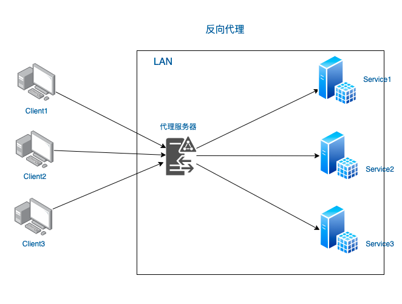

# 第零章：frp 项目简介

frp 是一个用于内网穿透的反向代理应用，可以将内网服务以安全、便捷的方式通过具有公网 IP 节点的中转暴露到公网。

## 背景

### 为什么需要内网穿透？

在日常工作中，我们经常会遇到将内网服务暴露到公网的需求，例如：

- 建网站
- 做调试
- 开游戏
- ...

但是，由于**ipv4 地址资源有限**，绝大多数内网环境并没有公网 IP，再加上 **ipv6 普及进程缓慢**，导致了内网服务无法直接暴露到公网的情况。

因此，需要一种技术手段，将内网服务通过具有公网 IP 的节点中转，从而解决没有公网 IP 的难题，这就是内网穿透技术。

### 什么是反向代理？

反向代理是一种位于服务器和客户端之间的代理服务器。客户端将请求发送给反向代理，然后由代理服务器根据一定的规则将请求转发给后端服务器。后端服务器将响应返回给代理服务器，再由代理服务器将响应转发给客户端。



反向代理的优势在于：

- **负载均衡**，提高系统的整体性能和稳定性。
- 隐藏真实服务器的信息，提高**安全性**。
- 缓存静态资源，减少后端服务器的负载，提高**响应速度**。

## frp 介绍

### 主要功能

通过在具有公网 IP 的节点上部署 frp 服务端，从而将内网服务穿透到公网。此外还提供诸多专业功能特性：

- 客户端服务端通信支持 TCP、QUIC、KCP 以及 Websocket 等多种协议。
- 采用 TCP 连接流式复用，在单个连接间承载更多请求，节省连接建立时间，降低请求延迟。
- 代理组间的负载均衡。
- 端口复用，多个服务通过同一个服务端端口暴露。
- 支持 P2P 通信，流量不经过服务器中转，充分利用带宽资源。
- 多个原生支持的客户端插件(静态文件查看，HTTPS/HTTP 协议转换，HTTP、SOCK5 代理等)，便于独立使用 frp 客户端完成某些工作。
- 高度扩展性的服务端插件系统，易于结合自身需求进行功能扩展。
- 服务端和客户端 UI 页面。

### 仓库信息

项目的仓库地址为：[https://github.com/fatedier/frp](https://github.com/fatedier/frp)。

这是一个由国人开发的开源项目，目前已经在 GitHub 上获得了 86.9k+ 的 star。

用`cloc`工具，可以统计出 frp 项目的代码行数：

```txt
-------------------------------------------------------------------------------
Language                     files          blank        comment           code
-------------------------------------------------------------------------------
Go                             223           4483           3425          25157
Markdown                         9            542              7           1351
Vuejs Component                 16             98              4           1058
TypeScript                      11             44             18            600
INI                              2             98              0            459
YAML                            11             36             53            395
TOML                             4             84            223            258
Bourne Shell                     3             25              4            142
JavaScript                       4              8             37            141
JSON                             5              2              0            111
make                             2             22              1             61
HTML                             4             12              0             46
CSS                              4              4              0             25
-------------------------------------------------------------------------------
SUM:                           298           5458           3772          29804
-------------------------------------------------------------------------------
```

可以看到，frp 项目主要使用 Go 语言编写，代码行数约为 25k 行。
