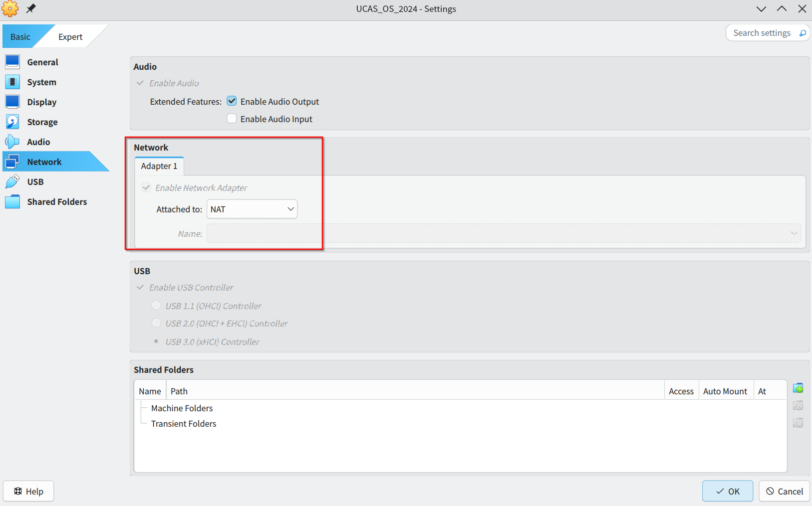
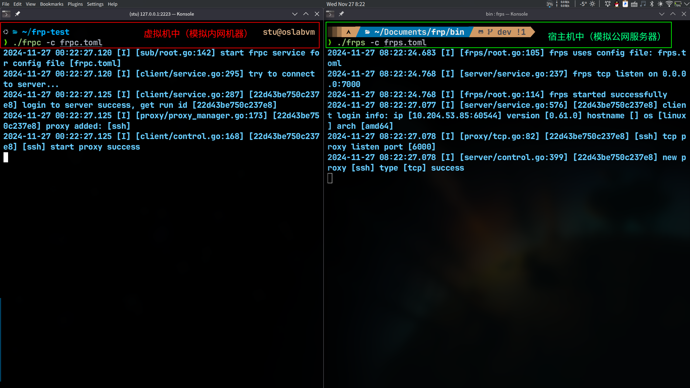
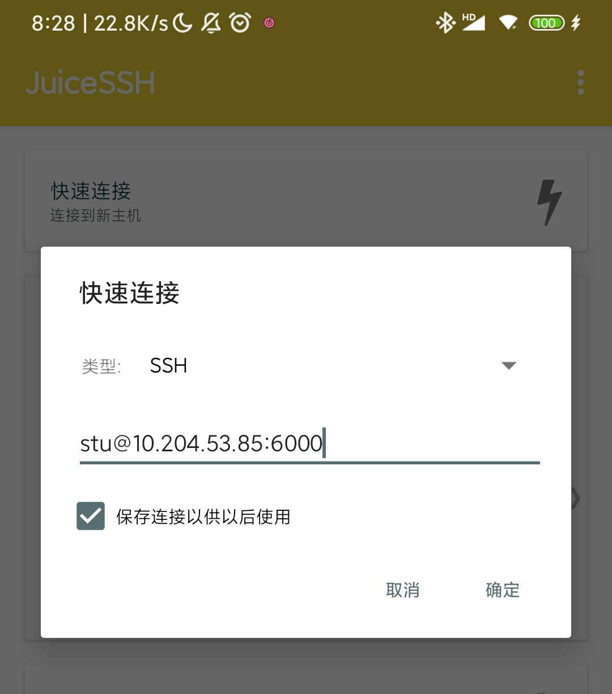
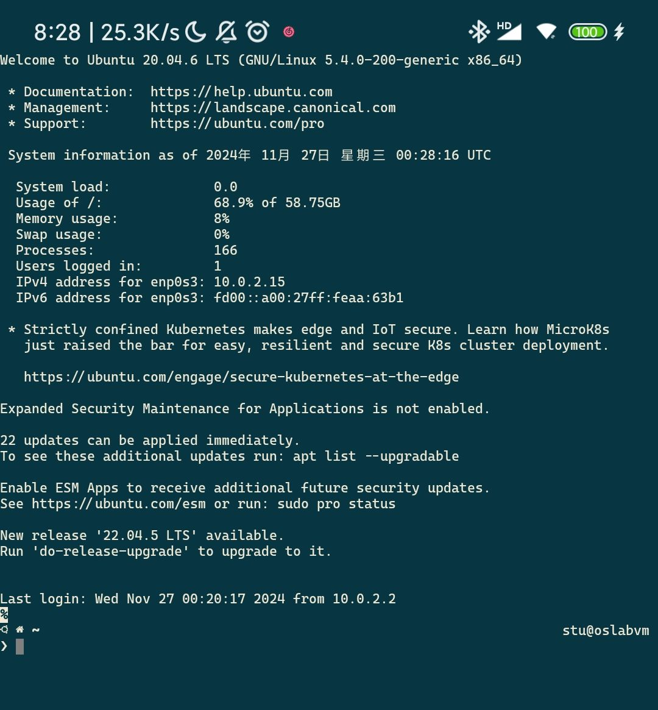
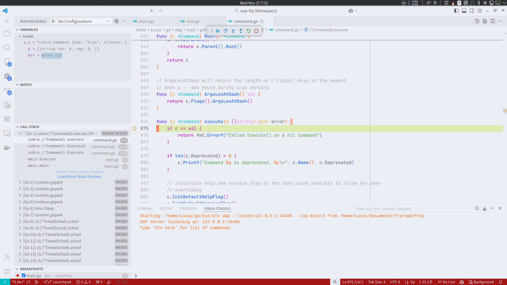

# **第二章：基本环境配置**

## **编译环境**

最新版的 frp 项目要求 Go 语言版本不低于 1.22。本人在编写本文时使用的 Go 版本为 1.23.3。
如果读者的 Go 版本较低，可以考虑在 Release 页面下载旧版本的 frp 项目进行编译。

## **项目构建**

如果上文 Go 语言环境配置成功，那么编译 frp 项目就非常简单了。只需要在项目根目录下执行以下命令：

```shell
make
```

这样就会在`bin`目录下生成`frps`和`frpc`两个可执行文件。

### **Makefile 分析**

从`Makefile`文件入手，可以快速了解到整个项目的构建过程：

```shell
all: env fmt build

build: frps frpc

...

frps:
    env CGO_ENABLED=0 go build -trimpath -ldflags "$(LDFLAGS)" -tags frps -o bin/frps ./cmd/frps

frpc:
    env CGO_ENABLED=0 go build -trimpath -ldflags "$(LDFLAGS)" -tags frpc -o bin/frpc ./cmd/frpc

...
```

可以看到，最关键的是`build`步骤：`build`规则会分别编译`cmd/frps`和`cmd/frpc`这两个目录下的源文件。
编译后的二进制文件生成在`bin`目录下，这就是最终的可执行文件。

### **项目目录结构**

通过`Makefile`文件的分析，我们可以得知项目的构建是从`cmd`目录下的`frps`和`frpc`开始的。
那么，我们就可以用`tree`工具进一步查看`cmd`目录的结构：

```shell
cmd
├── frpc # 客户端
│   ├── main # 客户端入口
│   └── sub # 客户端子模块
│       ├── admin   # 管理 frpc 的配置和状态
│       ├── nathole # 发现和分类 NAT 特性
│       ├── proxy   # 管理和运行 frpc 的代理和访问者配置
│       ├── root    # 管理和运行 frpc 客户端，包括加载配置、启动服务和处理终止信号
│       └── verify  # 验证 frpc 客户端的配置文件是否有效
└── frps # 服务端
    ├── main   # 服务端入口
    ├── root   # 管理和运行 frps 服务器，包括加载配置、启动服务和处理终止信号
    └── verify # 验证 frps 服务端的配置文件是否有效
```

这样，我们就可以从宏观上把握整个项目的结构，为后续的源码分析打下基础。

### **核心功能模块**

为了成功实现 frp 项目，仅仅依靠`cmd`目录下的`frps`和`frpc`是远远不够的。实际上，整个项目
的功能模块都在`server`、`client`和`pkg`目录下：

- `server`：包含了服务端`frps`所需要的模块。
- `client`：包含了客户端`frpc`所需要的模块。
- `pkg`：一些通用的模块，如`auth`、`config`、`errors`等。

通过调用这些模块，才能实现 frp 的各项功能。它们的目录结构层次和功能划分如下：

```shell
.
├── server # 服务端 frps 所需要的模块
│   ├── control       # 管理和控制 frp 服务器中的客户端连接和代理
│   ├── controller    # 集中管理和控制各种资源和功能
│   ├── dashboard_api # 通过 HTTP API 管理和监控 frp 服务器
│   ├── group         # 组的成员和属性
│   ├── metrics       # 服务器的度量指标，帮助监控和分析服务器的性能和状态
│   ├── ports         # 端口的分配和释放
│   ├── proxy         # 不同类型的代理
│   ├── service       # 服务器的各项服务和资源
│   └── visitor       # 访客连接
├── client # 客户端 frpc 所需要的模块
│   ├── admin_api     # 允许通过 HTTP 请求对客户端进行管理和控制
│   ├── connector     # 客户端与服务器之间的连接
│   ├── control       # 客户端的控制逻辑
│   ├── event         # 处理代理的启动和关闭事件
│   ├── health        # 定期检查代理的健康状态，并在状态变化时触发相应的回调函数
│   ├── proxy         # 不同类型的代理
│   ├── service       # 客户端的各项服务和资源
│   └── visitor       # 访客连接
└── pkg # 公共模块
    ├── auth          # 不同类型的身份验证
    ├── config        # 配置文件的解析
    ├── errors        # 标识和处理特定的错误情况
    ├── metrics       # 度量指标，帮助监控和分析 frp 的性能和状态
    ├── msg           # 消息传输和处理逻辑
    ├── nathole       # 实现 NAT 穿透(NAT hole punching)功能
    ├── plugin        # 扩展 frp 的插件
    ├── proto         # 处理数据包的转发和管理(目前只有 UDP)
    ├── sdk           # 允许通过 HTTP 请求管理和控制 frp 的行为
    ├── ssh           # SSH 隧道连接
    ├── transport     # 实现传输层安全(TLS)和消息传输功能
    ├── util          # 一些通用的工具函数
    └── virtual       # 虚拟客户端，模拟真实的客户端连接行为
```

利用`tree`工具查看该树状图，我们可以清晰了解整个项目的功能模块划分。
这符合面向对象设计*高内聚、低耦合*的思想。模块化的设计使得整个项目的功能更加清晰，易于维护。

## **启动服务**

为了能够成功启动 frp 服务，我们需要一台具有公网 IP 的服务器以及一台能够访问互联网的内网主机，
分别部署`frps`和`frpc`。

### 主要步骤

1. **配置服务器端(frps)**：
    - 在公网服务器上部署并运行`frps`，配置 `frps.toml` 文件，设置端口、token、通信加密等参数。
    - `frps`会监听指定端口，等待来自`frpc`客户端的连接请求。

2. **配置客户端(frpc)**：
    - 在内网机器上部署并运行`frpc`，配置 `frpc.toml` 文件，指定连接的服务器地址、端口、token
    等信息。
    - `frpc`会连接`frps`服务器，并注册自己的服务信息，这样可以让`frps`保存自己的服务信息。

3. **启动服务**：
    - 启动`frps`服务器，等待`frpc`客户端的连接。
    - 启动`frpc`客户端，连接到`frps`服务器，注册自己的服务信息。
    - 当有公网用户访问`frps`服务器的端口时，`frps`会将请求转发到`frpc`客户端，再由`frpc`将请求转发到内网的目标服务。

这样，我们就成功实现了内网穿透的功能，可以通过公网 IP 访问内网的服务了。

### **实操演示**

因为本人资源有限，没有具备公网 IP 的服务器。所以个人在局域网环境下利用虚拟机搭建了一个简单的 frp 服务。下面是具体的操作步骤：

首先，将本人物理机(操作系统为 Arch Linux)作为**服务器**，用来运行`frps`服务。配置`frps.toml`文件如下：

```toml
# frps.toml
bindPort = 7000 # 与 frpc 通信的端口
```

然后，在 VirtulBox 软件中打开虚拟机(操作系统为 Ubuntu 20.04)，
并将虚拟机的网络模式设置成 NAT 模式(网络地址转换)，如下图所示。



该模式下，虚拟机能通过虚拟网卡访问外部网络，也可以通过宿主机的局域网 IP 访问宿主机，
但是外部网络都不能直接访问虚拟机。这样就可以用虚拟机模拟**内网机器**。

将编译生成的`frpc`程序放入虚拟机，并在虚拟机中配置`frpc.toml`文件如下：

```toml
# frpc.toml
serverAddr = "10.204.53.85" # 宿主机在校园网环境下的局域网 IP
serverPort = 7000           # 与 frps 通信的端口

[[proxies]]
name       = "ssh"       # 开启的服务名称
type       = "tcp"       # 服务类型
localIP    = "127.0.0.1" # 虚拟机本地 IP
localPort  = 22          # 本地端口，因为 ssh 服务默认端口是 22
remotePort = 6000        # 原本为映射到公网的端口，这里是宿主机对外暴露的端口
```

最后，分别在宿主机和虚拟机上启动`frps`和`frpc`服务。

在宿主机上执行：

```shell
./frps -c frps.toml
```

在虚拟机上执行：

```shell
./frpc -c frpc.toml
```

这样，我们就成功搭建了一个简单的 frp 服务，如图所示：



为了验证 ssh 的服务成功从虚拟机中穿透出去，笔者将安卓手机(相当于**用户**)和宿主机连接在同一个校园网 WIFI 下。

一方面，安卓手机可以直接访问同一局域网下的宿主机；
另一方面，安卓手机对虚拟机而言是外部网络，所以并不能直接访问虚拟机。
如果安卓手机能通过宿主机向虚拟机发起 ssh 请求并且被响应，那么就说明 frp 服务成功实现了内网穿透。

在手机上使用 JuiceSSH 软件连接到宿主机`10.204.53.85`的`6000`端口，结果如下图：

{: style="height: 400px;"}
{: style="height: 400px;"}

可见，笔者的手机登录到虚拟机的 ssh 服务，虚拟机中的 ssh 服务成功通过 frp 穿透了内网。

## **调试环境**

本人推荐使用 VSCode 作为代码编辑器，可以直接通过官方的 Go 插件进行跟踪调试。



下面是本人分析 frp 服务工作过程中的调试环境配置，供读者参考：

```json
// .vscode/launch.json
{
    "version": "0.2.0",
    "configurations": [
        {
            "name": "frps debug",
            "type": "go",
            "request": "launch",
            "mode": "auto",
            "program": "${workspaceFolder}/cmd/frps",
            "args": ["-c", "${workspaceFolder}/conf/frps.toml"],
            "env": {},
            "cwd": "${workspaceFolder}",
            "console": "integratedTerminal"
        },
        {
            "name": "frpc debug",
            "type": "go",
            "request": "launch",
            "mode": "auto",
            "program": "${workspaceFolder}/cmd/frpc",
            "args": ["-c", "${workspaceFolder}/conf/frpc.toml"],
            "env": {},
            "cwd": "${workspaceFolder}",
            "console": "integratedTerminal"
        }
    ]
}
```

此外，也可以付费或者通过教育邮箱申请 JetBrains 的 GoLand IDE，
它提供了更加专业的 Go 语言开发环境(`Sequence Diagram`插件神中神!!!)。

## **小结**

本章节主要介绍了 frp 项目的基本环境配置过程。我们了解到，在 frp 服务的工作流程中，
服务端和客户端各自承担不同的角色，通过十分紧密的协作完成内网穿透的功能。

接下来的章节中，我们将进一步深入到 frp 项目的实现细节中，
分别从**主要功能**、**核心流程**以及**设计意图**三个维度对 frp 进行详细分析。
