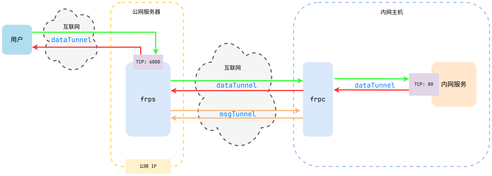

# 第三章：核心流程分析

在 frp 服务的工作流程中，服务端和客户端各自承担不同的角色，通过协作完成内网穿透的功能。

## 工作流程简述

下面通过文字与配图简要介绍 frp 的整体工作流程：

### 配置与启动

1. **配置服务器端(frps)**：
    - 在公网服务器上部署并运行`frps`，配置 `frps.ini` 文件，设置端口、token、通信加密等参数。
    - `frps`会监听指定端口，等待来自`frpc`客户端的连接请求。

2. **配置客户端(frpc)**：
    - 在内网机器上部署并运行`frpc`，配置 `frpc.ini` 文件，指定连接的服务器地址、端口、token
    等信息。
    - `frpc`会连接`frps`服务器，并注册自己的服务信息，这样可以让`frps`保存自己的服务信息。

3. **服务映射**：
    - 在`frpc`配置文件中设置需要映射到公网的服务端口，如将内网的 80 端口映射到公网的 6000 端口。
    - 当有公网用户访问`frps`服务器的 6000 端口时，请求会被转发到内网机器的 80 端口。

### 连接与数据传输

1. **建立连接**：
    - `frpc`会定时向`frps`发送**心跳包**以保持连接。
    - 当有外部请求到达`frps`，`frps`将请求转发给合适的`frpc`客户端，再由`frpc`将请求转发到
    内网的目标服务。

2. **数据传输**：
    - 通过 frp 的转发，外部用户就能访问内网的服务，实现内网穿透的效果。
    - 此外，经过 frp 传输的数据都通过了加密处理，以保证传输安全。
