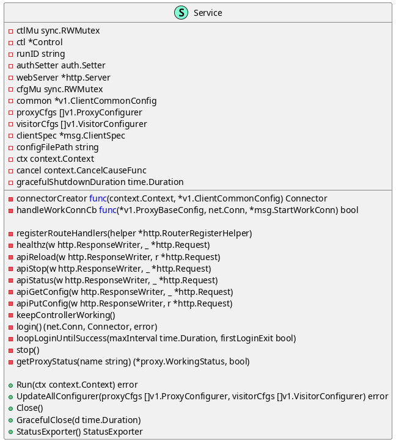
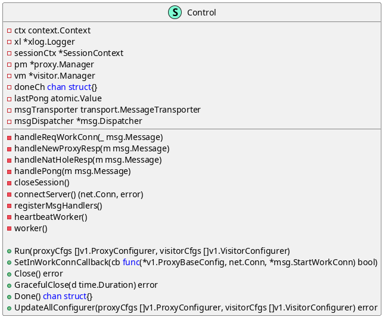
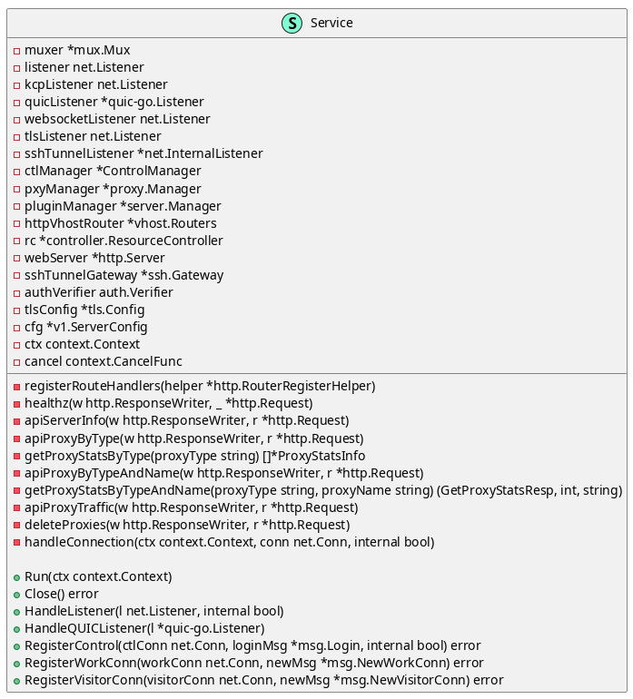
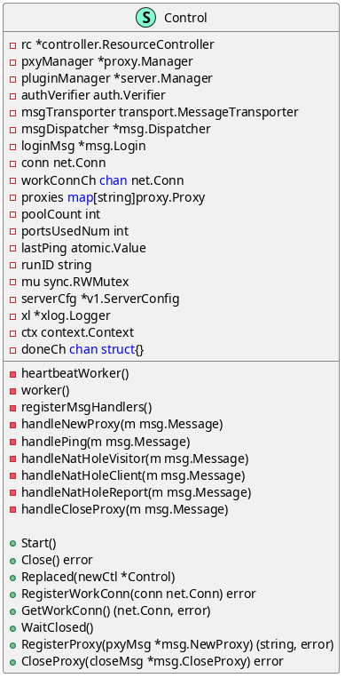
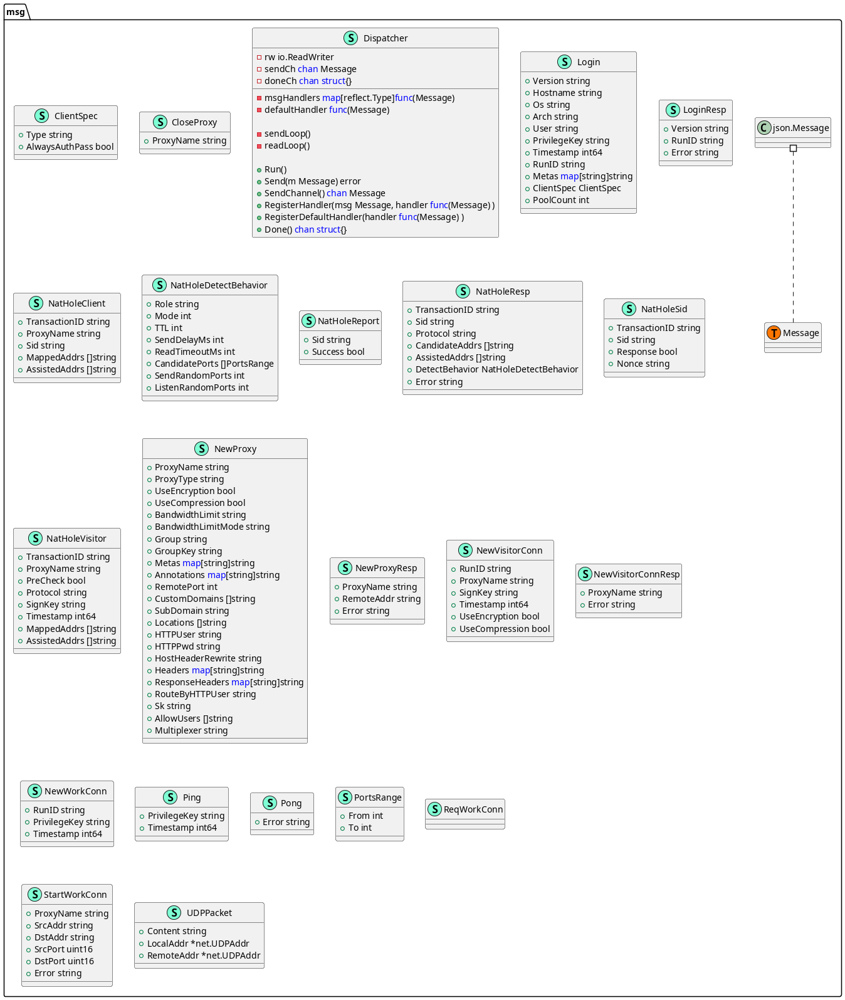
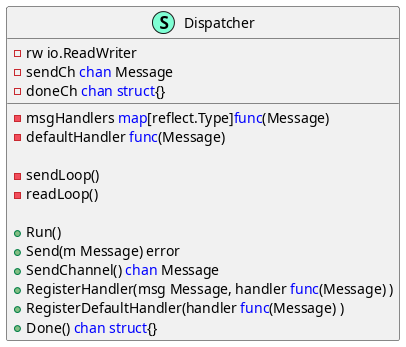

# **第三章：主要功能分析与建模**

frp 最核心的功能就是通过反向代理实现内网穿透，关于 frps 与 frpc 之间建立连接的具体过程将在下一章节详细叙述。
这里我们先关注与该核心功能紧密相关的几个模块：

- server
    - service
    - control
- client
    - service
    - control
- pkg
    - msg

下面将介绍这几个模块中的类，以及它们之间的关系。类图用工具 `goplantuml` 生成。

## **client 模块中的类**

### **client.Service**

用途：负责与服务器建立连接，管理代理和访客配置，并提供代理服务。
同时，还管理客户端的配置信息、身份验证和服务终止操作。

### **client.Control**

用途：负责管理与服务器的控制连接，处理代理和访客的信息，以及处理消息的传输和分发。

## **server 模块中的类**

### **server.Service**

用途：负责接受并处理来自客户端的连接请求，同时管理各种连接类型和相关组件。

### **server.Control**

用途：负责管理资源、代理和插件，验证客户端身份认证，处理消息传输和分发。

## **msg 模块中的类**

因为 `msg` 模块中类数量众多，他们的作用都集中于服务端、客户端以及用户间消息的传递：

其中，比较重要的是 `Dispatcher` ，它在应用程序中扮演关键角色，用于管理消息的发送和接收，
以及消息的处理分发。通过注册消息处理函数，可以根据不同类型的消息执行相应的操作，
实现消息的**定制化处理**。

