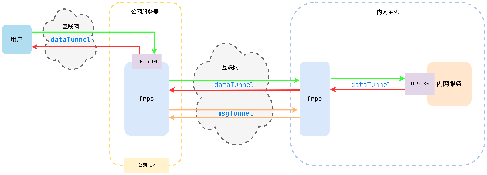

# **第四章：核心流程分析**

先前在第二章的[启动服务](./2.md#启动服务)小节中，已经简要介绍了 frp 服务的部署与启动流程。
本章中，我们将把注意力放在 frp 服务的核心流程上——**建立连接**并进行**数据传输**，
这也是 frp 服务的根本目的。

为了方便理解，下面是本人用 draw.io 绘制的 frp 工作流程图：

我们将关注重心放在 frps 和 frpc 之间服务的建立，可以看到二者间有两条重要的通道:

- msgTunnel：控制消息传输隧道，用于处理消息控制传输而非实际数据转发
    - 定时向服务器发送**心跳包**以保持连接
    - 当用户访问服务器时，检查是否启动 dataTunnel
    - 进行 token 验证，以保证连接安全
- dataTunnel：数据传输隧道，用于数据转发（外部请求->`frps`->`frpc`->内网服务）

通过 frp 的转发，外部用户就能访问内网的服务，实现内网穿透的效果。

下面分别从 frps 和 frpc 两个角度来详细介绍这两个通道的建立过程。因为函数调用深度较大，
并且实现细节较多（涉及到各种协议的兼容以及错误处理），所以这里不直接展示源码，
而是通过自己绘制的时序图来展示 frps 和 frpc 之间的通信过程。

## **frps**

可以看到，frps 作为服务器端，主要通过 `Server` 类的 `HandleListener()` 方法来监听客户端的连接请求。

如果检测到有新的连接请求，用 `handleConnection()` 方法来处理，
调用 `RegisterControl()` 方法来注册控制通道，创建一个 `Control` 实例 `ctl`。

`ctl` 对象用 `worker()` 方法建立控制通道和数据通道，其中控制通道用于处理消息传输，

## **frpc**

对于 frpc 客户端，主要通过 `Server` 类的 `Run()` 方法来建立与服务器的连接。

首先通过 `loginUntilSuccess()` 不断重试直到登录成功，然后调用 `login()` 方法来登录服务器。

登录成功后，调用 `NewControl()` 方法来创建一个 `Control` 实例 `ctl`。该实例调用 `worker()` 方法建立控制通道和数据通道。
`worker()`方法中的具体流程和 frps 类似，但实现细节不同，尤其是对心跳包的处理，这在后面的章节中会详细介绍。
