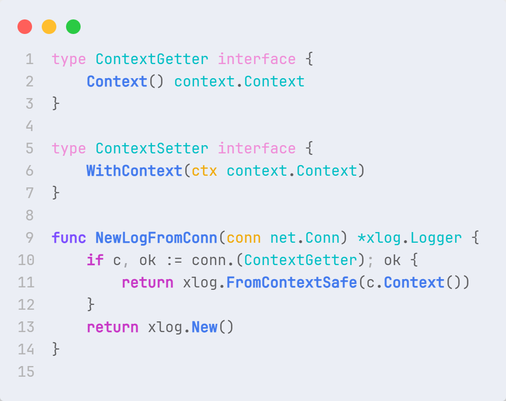
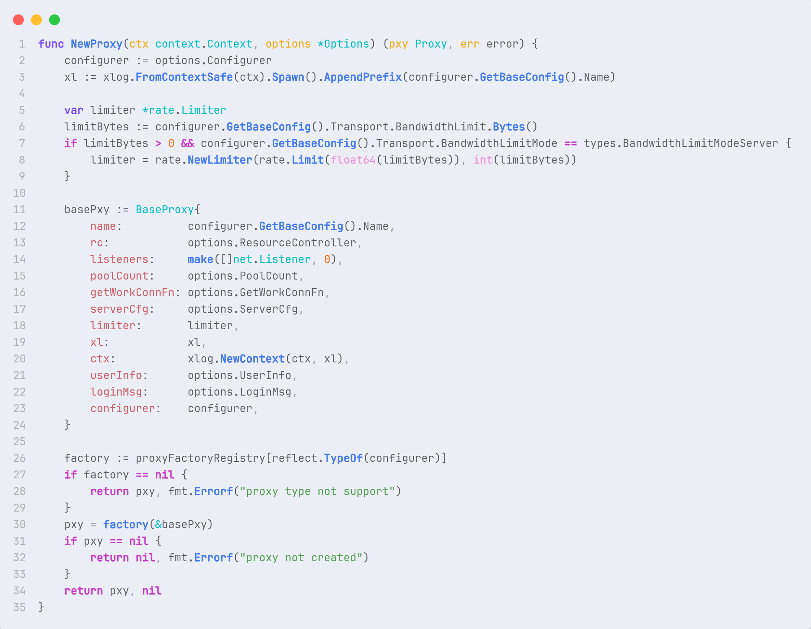

# **第五章：复杂设计意图分析**

这里介绍涉及到的三个设计模式：**策略模式**、**观察者模式**和**简单工厂模式**。

此外，其实还有**外观模式**，但是因为设计模式的汇报中已经提到过，所以这里不再赘述。

## **策略模式**

在策略模式定义了一系列算法或策略，并将每个算法封装在独立的类中，使得它们可以互相替换。通过使用策略模式，可以在运行时根据需要选择不同的算法，而不需要修改客户端代码。

观察`NewLogFromConn` 函数：当传入的 `net.Conn` 对象实现了 `ContextGetter` 接口时，会从中获取上下文并使用该上下文创建日志记录器，
这种做法可以被视为一种策略选择，即根据不同的上下文获取策略来创建日志记录器。

## **观察者模式**

定义一种订阅机制， 可在对象事件发生时通知多个 “观察” 该对象的其他对象。

在 frp 中，通过心跳包机制来保持 frps 和 frpc 之间的连接，这里就用到了观察者模式。

1. 客户端 `heartbeatWorker`：负责定期向服务器发送心跳消息，以保持与服务器的连接活跃。客户端会定期发送心跳消息给服务器。同时，客户端会检查服务端对心跳响应超时，如果超时则关闭会话。
2. 服务器端 `heartbeatWorker`：服务器端的 `heartbeatWorker` 也负责检查心跳超时，但是逻辑稍有不同。 服务器端会定期检查从客户端接收到的心跳时间，如果超时则关闭与客户端的连接。

## **简单工厂模式**

一种创建型设计模式， 其在父类中提供一个创建对象的方法， 允许子类决定实例化对象的类型。

下面的 `NewProxy` 函数就是一个简单工厂模式的应用，
根据传入的 `Options` 参数和上下文 `ctx`，创建一个基础代理 `BaseProxy` 对象。

